# Gridviz


[](http://www.awesomeofficialstatistics.org)

<p align="center" style="height: 350px;">
    
</p>

[Gridviz](https://github.com/eurostat/gridviz/) is a JavaScript library for visualizing gridded data (or any tabular dataset with x/y coordinates for that matter) in the browser using a large variety of [cartographic styles and techniques](https://github.com/eurostat/gridviz/blob/master/docs/gallery.md). Unlike traditional raster-based web mapping tools, Gridviz renders everything client-side, on the fly.

## Styles

[Visit the style gallery](https://github.com/eurostat/gridviz/blob/master/docs/gallery.md) to see the different customisable styles available for visualizing gridded data with gridviz.

[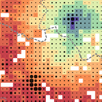](https://eurostat.github.io/gridviz/docs/reference#shapecolorsize-style)
[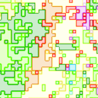](https://eurostat.github.io/gridviz/docs/reference#side-category-style)
[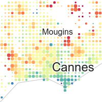](https://eurostat.github.io/gridviz/docs/reference#shapecolorsize-style)
[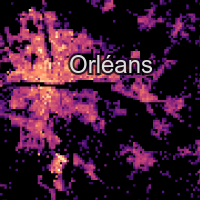](https://eurostat.github.io/gridviz/docs/reference#square-color-webgl-style)
[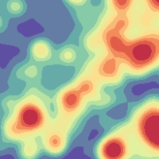](https://eurostat.github.io/gridviz/docs/reference#kernel-smoothing)
[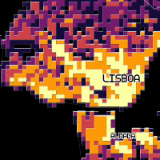](https://eurostat.github.io/gridviz/docs/reference#tanaka-style)
[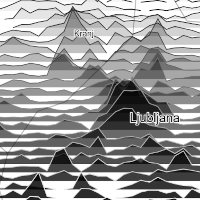](https://eurostat.github.io/gridviz/docs/reference#joyplot-style)
[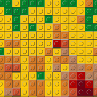](https://eurostat.github.io/gridviz/docs/reference#lego-style)
[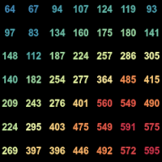](https://eurostat.github.io/gridviz/docs/reference#text-style)
[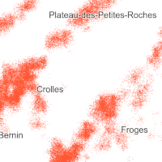](https://eurostat.github.io/gridviz/docs/reference#dot-density-style)
[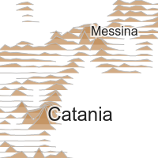](https://eurostat.github.io/gridviz/docs/reference#joyplot-style)

## Live Demos

-   [**Europe** - 1km resolution - GEOSTAT/GISCO](https://eurostat.github.io/gridviz/examples/demos/EUR.html)
-   [**Germany** - 100m resolution - Zensus 2011](https://eurostat.github.io/gridviz/examples/demos/DE.html)
-   [**France** - 200m resolution - INSEE Filosofi](https://eurostat.github.io/gridviz/examples/demos/FR.html). Focus on [total population](https://eurostat.github.io/gridviz/examples/demos/FR_pop.html) and [income](https://eurostat.github.io/gridviz/examples/demos/FR_income.html).
-   [**Norway** - 250m resolution - SSB](https://eurostat.github.io/gridviz/examples/demos/NO.html)
-   [**Croatia** - 1km resolution - DZS 2015 grid](https://eurostat.github.io/gridviz/examples/demos/HR.html)
-   [**Belgium** population](https://eurostat.github.io/gridviz/examples/basics/mixed_resolution_BE.html), as mixed resolution layer.

## Installation

### Node.js

```Shell
npm install gridviz
```

then

```javascript
import * as gridviz from 'gridviz'
```

Or you can cherry-pick only the modules that you need, for example:

```javascript
import { Map, SquareColorWebGLStyle } from 'gridviz'
```

### Basic example

Here’s a basic example that loads a CSV file of a European population grid (5km resolution):

```javascript
//define map with initial view
const map = new gridviz.Map(document.getElementById('map'), { x: 4500000, y: 2900000, z: 3000 })

//define dataset
const dataset = new gridviz.CSVGrid(
    map,
    'https://raw.githubusercontent.com/eurostat/gridviz/master/assets/csv/Europe/pop_2018_10km.csv',
    10000
)

//define color for each cell
const colorFunction = (cell) => {
    if (cell.population > 150000) return '#993404'
    else if (cell.population > 60000) return '#d95f0e'
    else if (cell.population > 20000) return '#fe9929'
    else if (cell.population > 6000) return '#fec44f'
    else if (cell.population > 1500) return '#fee391'
    else return '#ffffd4'
}

//define style
const style = new gridviz.ShapeColorSizeStyle({ color: colorFunction })

//add layer to map
map.layers = [new gridviz.GridLayer(dataset, [style])]
```

See the **[documentation page](https://eurostat.github.io/gridviz/docs/reference)** for more information.

### standalone

```javascript
<script src="https://unpkg.com/gridviz/dist/gridviz.min.js"></script>
```

## Documentation

See the **[gridviz documentation page](./docs/reference.md)**.

The document of [the previous version 2](./docs/reference_v2.md).

## Grid tiling

In order to visualize large grids efficiently, you can produce tiled grids in a [tiled grid format](https://eurostat.github.io/gridviz/docs/tiledformat) with **[GridTiler](https://github.com/eurostat/gridtiler)**.

## About

|                |                                                                                                                                                                                       |
| -------------- | ------------------------------------------------------------------------------------------------------------------------------------------------------------------------------------- |
| _contributors_ | [](https://github.com/jgaffuri) [](https://github.com/JoeWDavies) |
| _version_      | See [npm](https://www.npmjs.com/package/gridviz?activeTab=versions)                                                                                                                   |
| _status_       | Since 2020                                                                                                                                                                            |
| _license_      | [EUPL 1.2](LICENSE)                                                                                                                                                                   |

### Support and contribution

Feel free to [ask support](https://github.com/eurostat/gridviz/issues/new), fork the project or simply star it (it's always a pleasure).

### Copyright

The [Eurostat NUTS dataset](http://ec.europa.eu/eurostat/web/nuts/overview) is copyrighted. There are [specific provisions](https://ec.europa.eu/eurostat/web/gisco/geodata/statistical-units) for the usage of this dataset which must be respected. The usage of these data is subject to their acceptance. See the [Eurostat-GISCO website](https://ec.europa.eu/eurostat/web/gisco/geodata/statistical-units/territorial-units-statistics) for more information.

### Disclaimer

The designations employed and the presentation of material on these maps do not imply the expression of any opinion whatsoever on the part of the European Union concerning the legal status of any country, territory, city or area or of its authorities, or concerning the delimitation of its frontiers or boundaries. Kosovo*: This designation is without prejudice to positions on status, and is in line with UNSCR 1244/1999 and the ICJ Opinion on the Kosovo declaration of independence. Palestine*: This designation shall not be construed as recognition of a State of Palestine and is without prejudice to the individual positions of the Member States on this issue.
