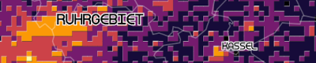
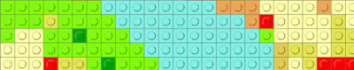
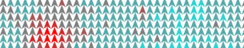
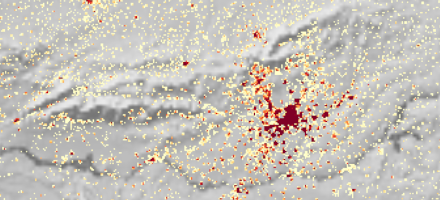
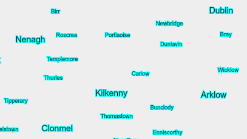
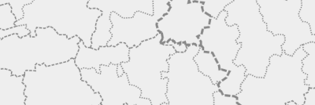
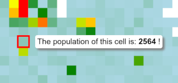

# Gridviz API reference

## Table of contents

- [Gridviz API reference](#gridviz-api-reference)
  - [Table of contents](#table-of-contents)
  - [Usage](#usage)
  - [Map Configuration](#map-configuration)
    - [Map options object](#map-options-object)
  - [Multi layer, multi style and multi scale mapping](#multi-layer-multi-style-and-multi-scale-mapping)
  - [Adding data](#adding-data)
    - [Single CSV file](#single-csv-file)
    - [Multi scale CSV data](#multi-scale-csv-data)
    - [Tiled data](#tiled-data)
    - [Multi scale tiled data](#multi-scale-tiled-data)
    - [Data pre-processing and filtering](#data-pre-processing-and-filtering)
  - [Basic styles](#basic-styles)
    - [Shape/Color/Size Style](#shapecolorsize-style)
    - [Square color WebGL Style](#square-color-webgl-style)
    - [Square color category WebGL style](#square-color-category-webgl-style)
    - [Composition style](#composition-style)
    - [Segment style](#segment-style)
    - [Stroke style](#stroke-style)
  - [Advanced styles](#advanced-styles)
    - [Tanaka style](#tanaka-style)
    - [Dot density style](#dot-density-style)
    - [Pillars style](#pillars-style)
    - [Text style](#text-style)
    - [Time series style](#time-series-style)
  - [Side styles](#side-styles)
    - [Side style](#side-style)
    - [Side category style](#side-category-style)
    - [Contour style](#contour-style)
    - [Isometric fence style](#isometric-fence-style)
  - [Esthetic styles](#esthetic-styles)
    - [JoyPlot Style](#joyplot-style)
    - [Mosaic style](#mosaic-style)
    - [Ninja star style](#ninja-star-style)
    - [Lego style](#lego-style)
    - [Lego category style](#lego-category-style)
  - [Kernel smoothing](#kernel-smoothing)
  - [Custom styles](#custom-styles)
  - [Legends](#legends)
    - [ColorCategoryLegend](#colorcategorylegend)
    - [ColorDiscreteLegend](#colordiscretelegend)
    - [ColorLegend](#colorlegend)
    - [SegmentOrientationLegend](#segmentorientationlegend)
    - [SegmentWidthLegend](#segmentwidthlegend)
    - [SizeLegend](#sizelegend)
    - [Legend styling](#legend-styling)
  - [Stretching](#stretching)
  - [Background layer](#background-layer)
    - [Tiled layer](#tiled-layer)
    - [WMS](#wms)
  - [Foreground information](#foreground-information)
    - [Showing labels](#showing-labels)
    - [Showing boundaries](#showing-boundaries)
  - [Transparency](#transparency)
  - [Tooltip](#tooltip)
  - [Leaflet](#leaflet)
  - [Alright?](#alright)

Anything unclear or missing? Feel free to [ask](https://github.com/eurostat/gridviz/issues/new) !

## Usage

Create a [Gridviz](https://github.com/eurostat/gridviz/) map using `const map = new gridviz.Map();` and customise it with the methods described in the documentation below.

Here's a basic example that loads a CSV file on Europe population (5km resolution):

```javascript
new gridviz.Map(containerDiv)
    //set position and zoom
    .setGeoCenter({ x: 4500000, y: 2900000 })
    .setZoom(3000)
    //add CSV layer
    .addCSVGridLayer(
        //data URL
        'https://raw.githubusercontent.com/eurostat/gridviz/master/assets/csv/Europe/pop_2018_5km.csv',
        //resolution, in CRS unit (m)
        5000,
        //the style
        [
            new gridviz.SquareColorWGLStyle({
                //the CSV column to show
                colorCol: 'Population',
                //value to [0,1] mapping function, see [below](#stretching)
                tFun: (value) => gridviz.sExp(Math.min(value / 100000, 1), -15),
            }),
        ]
    )
```

(see [online](https://eurostat.github.io/gridviz/examples/basic_CSV.html), see [code](https://github.com/eurostat/gridviz/blob/master/examples/basic_CSV.html))

[Gridviz](https://github.com/eurostat/gridviz/) can display several layers on top of each others. Each layer is based on a single [multi-resolution dataset](#adding-data), which can be displayed with several [cartographic styles](#basic-styles). For more information, see the [examples](#examples).

## Map Configuration

The following methods allow further configuration of a [Gridviz](https://github.com/eurostat/gridviz/) map:

| Method                                                                      | Type                                                                           | Default       | Description                                                                                        |
| --------------------------------------------------------------------------- | ------------------------------------------------------------------------------ | ------------- | -------------------------------------------------------------------------------------------------- |
| _map_.**getGeoCenter**()<br />_map_.**setGeoCenter**([value])               | { x:number, y:number }                                                         | { x:0, y:0 }  | Get/set the geographical coordinates of the view center.                                           |
| _map_.**getZoom**()<br />_map_.**setZoom**([value])             | number                                                                         | 1             | Get/set the view zoom. This  is expressed as the size of a pixel in ground distance.    |
| _map_.**getZoomExtent**()<br />_map_.**setZoomExtent**([value]) | Array(number)                                                                  | [0, Infinity] | Get/set the view zoom extent, in order to prevent the user to zoom in/out beyond some zoom levels. |
| _map_.**getBackgroundColor**()<br />_map_.**setBackgroundColor**([value])   | string                                                                         | "white"       | Get/set the map background color.                                                                  |
| _map_.**getBoundaryLayer**()<br />_map_.**setBoundaryLayer**([value])       | LineLayer / object                                                             | undefined     | A layer for boundary lines, see [here](#showing-boundaries).                                       |
| _map_.**getLabelLayer**()<br />_map_.**setLabelLayer**([value])             | LabelLayer / object                                                            | undefined     | A layer for labels (such as placenames), see [here](#showing-labels).                              |
| _map_.**addBackgroundLayer**([options])                                     | object                                                                         |               | Add a background image layer, see [here](#background-layer).                                       |
| _map_.**addZoomButtons**([options])                                         | All properties are optional <br> {  **id**: `HTML element id`, **class**: `HTML element CSS class`, **x**: `CSS 'left' property`,  **y**: ```CSS 'top' property```,  **onZoom**: `Custom event handler when user clicks zoom in or out`,  <br /> **delta**: `The delta applied to each zoom event.`  } | {  **id**: 'gridviz-zoom-buttons',  **x**: map width - 50,   **y**: 10,  **onZoom**: undefined,  **delta**: 0.2  }| Add zoom in and zoom out buttons to the viewer. |
| _map_.**addFullscreenButton**([options])                                         | All properties are optional <br>  {  **id**: `HTML element id`, **class**: `HTML element CSS class` **x**: `CSS 'left' property`,  **y**: ```CSS 'top' property``` } | {  **id**: 'gridviz-zoom-buttons',  **x**: map width - 50,  **y**: 10  }| Add a button to the viewer that toggles fullscreen mode. |
| _map_.**setViewFromURL**() | | | Set view geo center and zoom from URL parameters _x_, _y_ and _z_. For example, using the URL _myPage.html?x=1000&y=2000&z=45_ will force the viex to center to geographical coordinates _(1000, 2000)_ and zoom _45_. |
| _map_.**redraw**() | | | Force the map to redraw. |
| _map_.**destroy**() | | | Destroy the map, canvas, legend and tooltip and remove their event listeners. |

### Map options object

When building a gridviz map, in addition to the container element you can also specify an options object with the properties outlined in the table below.

For example:

```javascript
new gridviz.Map(containerDiv, {
    w: 600,
    h: 600,
    legendDivId: 'myLegendDiv',
    selectionRectangleColor: 'red',
    selectionRectangleWidthPix: () => '1',
    backgroundColor: 'white',
    tooltip: {
        fontSize: '1.2em',
        transitionDuration: 100,
    },
    onZoomStartFun: (event) => {
        console.log('pan/zoom start', event)
    },
    onZoomFun: (event) => {
        console.log('zoom', event)
    },
    onZoomEndFun: (event) => {
        console.log('pan/zoom end', event)
    },
})
```

| Property                              | Type              | Default                          | Description                                                                                                                                                         |
| ------------------------------------- | ----------------- | -------------------------------- | ------------------------------------------------------------------------------------------------------------------------------------------------------------------- |
| _opts_.**canvas**                     | HTMLCanvasElement | created automatically by gridviz | Specify your own canvas element upon which gridviz will be rendered.                                                                                                |
| _opts_.**w**                          | number            | container.offsetWidth            | The width of the canvas.                                                                                                                                            |
| _opts_.**h**                          | number            | container.offsetHeight           | The height of the canvas.                                                                                                                                           |
| _opts_.**legendDivId**                | string            | 'gvizLegend'                     | The identifier of the element upon which the legend will be appended.                                                                                               |
| _opts_.**selectionRectangleColor**    | string            | 'red'                            | The colour of the outline when a cell is highlighted.                                                                                                               |
| _opts_.**selectionRectangleWidthPix** | Function          | (r,z) => 4                      | A function specifying the thickness in pixels of the outline when a cell is highlighted. The function parameter _r_ is the cell resolution. _z_ is the zoom level. |
| _opts_.**transparentbackground**      | boolean           | false                            | Whether the background should be filled with colour (backgroundColor) or not. It is essentially the difference between using context.fillRect vs context.clearRect. |
| _opts_.**backgroundColor**            | string            | 'white'                          | The background color of the canvas when transparentBackground is set to false.                                                                                      |
| _opts_.**disableZoom**                | Boolean           | false                            | Disables d3 pan and zoom when set to true.                                                                                                                          |
| _opts_.**onZoomStartFun**             | Function          | null                             | Event handler for when a pan/zoom event is initiated.                                                                                                               |
| _opts_.**onZoomFun**                  | Function          | null                             | Event handler for when a pan/zoom event is occurring.                                                                                                               |
| _opts_.**onZoomEndFun**               | Function          | null                             | Event handler for when a pan/zoom event has finished.                                                                                                               |
| _opts_.**tooltip**                    | Object            | undefined                        | See [tooltip docs](#tooltip)                                                                                                                                        |

## Multi layer, multi style and multi scale mapping

A [Gridviz](https://github.com/eurostat/gridviz/) map is organised as a stack of layers accessible through **myMap.layers** property. Each layer shows data from one single dataset **myLayer.dataset**, following a list of styles **myLayer.styles**. The map can adapt to the visualisation scale/zoom level with the following mechanisms:

-   Multi-resolution datasets can be defined, so that different grid resolutions can be shown depending to the zoom level, see [the multi-scale datasets in the next section](#adding-data).
-   The layers and styles can be restricted to some scale, using their **minZoom** and **maxZoom** properties to define the zoom ranges for which they will be shown.
-   Most style parameters are not static values, but _functions_ of various parameters, including the map , usually noted **z** (for "") which represent the size of a pixel screen in ground meter. Style parameters can thus be defined depending on the zoom level so that they adapt to the visualisation scale.
-   Transparency can be defined at layer or style level with their **alpha** and **blendOperation** properties (see CanvasRenderingContext2D [globalAlpha](https://developer.mozilla.org/en-US/docs/Web/API/CanvasRenderingContext2D/globalAlpha) and [globalCompositeOperation](https://developer.mozilla.org/en-US/docs/Web/API/CanvasRenderingContext2D/globalCompositeOperation) properties). These values are also not static, but functions of the  **z**. It is thus possible to define the transparency depending on the zoom level,so that a layer or a style fades away when zooming in or out.

For further information, see the [examples](../examples/).

## Adding data

Input data are tabular data, in CSV format.

For the position of the cell, two columns **x** and **y** must be specified, with the geographical coordinates of the **lower left corner** of the cell, expressed in the grid Coordinate Reference System. If this information is not explicitelly provided in the input data, it is however possible to compute it on-the-fly as explained [here](#data-pre-processing).

It is possible to specify different data sources for different zoom levels, so that the level of detail of the data can adapt to the zoom level. Tiled data can also be specified following the [tiled format](tiledformat.md).

Are are several examples:

### Single CSV file

This is the simplest case, when a unique CSV file is loaded. See the [basic example above](#usage).

### Multi scale CSV data

When several CSV files contain the data with different resolutions, it is possible to define a multi-scale dataset from those files. The change of dataset depending on the zoom level is controled with the **minPixelsPerCell** parameter:

```javascript
new gridviz.Map(containerDiv)
    //set position and zoom
    .setGeoCenter({ x: 4500000, y: 2900000 })
    .setZoom(3000)
    //add multiscale CSV layer
    .addMultiScaleCSVGridLayer(
        //array of resolutions, in CRS unit (m)
        [5000, 10000, 20000, 50000, 100000],
        //function which returns the URL for each resolution value
        (r) =>
            'https://raw.githubusercontent.com/eurostat/gridviz/master/assets/csv/Europe/pop_2018_' +
            Math.round(r / 1000) +
            'km.csv',
        //the styles
        [
            new gridviz.SquareColorWGLStyle({
                colorCol: 'population',
                tFun: (value, resolution, stats) => gridviz.sExp(value / stats.max, -50),
            }),
        ],
        {
            //the maximum pixel size before jumping to a lower resolution
            minPixelsPerCell: 3,
        }
    )
```

(see [online](https://eurostat.github.io/gridviz/examples/basic_multiscale_CSV.html), see [code](https://github.com/eurostat/gridviz/blob/master/examples/basic_multiscale_CSV.html))

### Tiled data

For large datasets, it is recommended that you decompose them into different data chunks and index them by geographical location, as specified in the [tiled format specification](tiledformat.md). The [Gridviz](https://github.com/eurostat/gridviz/) map can then automatically retrieve only the useful data that falls into the viewer's geographical extent. Here is an example of how to load such data:

```javascript
new gridviz.Map(containerDiv)
    //set position and zoom
    .setGeoCenter({ x: 4500000, y: 2900000 })
    .setZoom(3000)
    //add multi scale tiled layer
    .addTiledGridLayer(
        //data URL
        'https://raw.githubusercontent.com/jgaffuri/tiledgrids/main/data/europe/population2/5000m/',
        //the styles
        [
            new gridviz.SquareColorWGLStyle({
                colorCol: 'TOT_P_2021',
                tFun: (value) => gridviz.sExp(Math.min(value / 100000, 1), -15),
            }),
        ]
    )
```

(see [online](https://eurostat.github.io/gridviz/examples/basic_tiled_CSV.html), see [code](https://github.com/eurostat/gridviz/blob/master/examples/basic_tiled_CSV.html))

### Multi scale tiled data

Multi scale tiled data based on the [tiled format](tiledformat.md) can also be simply loaded with the example below. Here again, the change of dataset depending on the zoom level is controled with the **minPixelsPerCell** parameter:

```javascript
new gridviz.Map(containerDiv)
    //set position and zoom
    .setGeoCenter({ x: 4500000, y: 2900000 })
    .setZoom(3000)
    //add multi scale tiled layer
    .addMultiScaleTiledGridLayer(
        //array of resolutions, in CRS unit (m)
        [5000, 10000, 20000, 50000, 100000],
        //function which returns the URL for each resolution value
        (r) =>
            'https://raw.githubusercontent.com/jgaffuri/tiledgrids/main/data/europe/population2/' + r + 'm/',
        //the styles
        [
            new gridviz.SquareColorWGLStyle({
                colorCol: 'TOT_P_2018',
                tFun: (value, resolution, stats) => gridviz.sExp(value / stats.max, -50),
            }),
        ],
        {
            //the maximum pixel size before jumping to a lower resolution
            minPixelsPerCell: 3,
        }
    )
```

(see [online](https://eurostat.github.io/gridviz/examples/basic_multiscale_tiled_CSV.html), see [code](https://github.com/eurostat/gridviz/blob/master/examples/basic_multiscale_tiled_CSV.html))

| Method                                        | Arguments                                  | Description                                        |
| --------------------------------------------- | ------------------------------------------ | -------------------------------------------------- |
| _map_.**addCSVGridLayer**([args])             | See [example](#single-csv-file)            | Add a layer from a CSV grid dataset.               |
| _map_.**addMultiScaleCSVGridLayer**([args])   | See [example](#multi-scale-csv-data)       | Add a layer from a multi scale CSV grid dataset.   |
| _map_.**addTiledGridLayer**([args])           | See [example](#tiled-csv-data)             | Add a layer from a tiled grid dataset.             |
| _map_.**addMultiScaleTiledGridLayer**([args]) | See [example](#multi-scale-tiled-csv-data) | Add a layer from a multi scale tiled grid dataset. |

To manage creation of datasets and their possible reuse accross different layers (so that the data is loaded and stored once), the following methods are also available:

| Method                                           | Arguments | Description                            |
| ------------------------------------------------ | --------- | -------------------------------------- |
| _map_.**addLayer**([args])            | -         | Add a layer to the map.                |
| _map_.**makeCSVGridDataset**([args])             | -         | Make a CSV grid dataset.               |
| _map_.**makeTiledGridDataset**([args])           | -         | Make a tiled grid dataset.             |
| _map_.**makeMultiScaleCSVGridDataset**([args])   | -         | Make a multi scale CSV grid dataset.   |
| _map_.**makeMultiScaleTiledGridDataset**([args]) | -         | Make a multi scale tiled grid dataset. |

### Data pre-processing and filtering

Input data can be processed/transformed before it is being used by the [Gridviz](https://github.com/eurostat/gridviz/) map in order to, for example:

-   Filter/simplify the data to keep only the necessary one. This allows saving client memory,
-   Extract/compute each cell coordinates into the **x** and **y** columns, in case the input data does not contain such columns explicitelly,
-   Compute a new column from the combination of existing ones, such as the ratio between two columns, or the aggregation of several columns,
-   Run some data conversions, simplifications, aggregations, etc.
-   Etc.

This process is run on each cell individually, only once, after the data has been downloaded.

Here is an example showing how to compute a new column on population change, as the difference between two columns _TOT_P_2021_ and _TOT_P_2011_. This new column is then used directly to be shown on the map:

```javascript
new gridviz.Map(containerDiv)
    .setGeoCenter({ x: 4500000, y: 2900000 })
    .setZoom(3000)
    .addMultiScaleTiledGridLayer(
        [1000, 2000, 5000, 10000, 20000, 50000, 100000],
        (r) =>
            'https://raw.githubusercontent.com/jgaffuri/tiledgrids/main/data/europe/population2/' + r + 'm/',
        [
            new gridviz.ShapeColorSizeStyle({
                /* style construction ... */
            }),
        ],
        {
            preprocess: (c) => {
                //for each cell, compute 2011 -> 2021 change and store it in a new "change" column
                if (!c.TOT_P_2011 && !c.TOT_P_2021) c.change = 0
                else if (!c.TOT_P_2011 && c.TOT_P_2021) c.change = +c.TOT_P_2021
                else if (c.TOT_P_2011 && !c.TOT_P_2021) c.change = -c.TOT_P_2011
                else c.change = c.TOT_P_2021 - c.TOT_P_2011
                //remove unused information
                delete c.TOT_P_2006
                delete c.TOT_P_2011
                delete c.TOT_P_2018
                delete c.TOT_P_2021
            },
            minPixelsPerCell: 3,
        }
    )
```

(see [online](https://eurostat.github.io/gridviz/examples/preprocess.html), see [code](https://github.com/eurostat/gridviz/blob/master/examples/preprocess.html))

Note that it is unfortunatelly currently not possible to compute new columns from the combination of two different datasets.

The **preprocess** function can also be used to remove/filter unnecessary cells and release memory resources. This can be achieved by returning **false** for the cells to remove.

Here is an example showing how to keep only the cells with specific values **41**:

```javascript
new gridviz.Map(containerDiv)
    .setGeoCenter({ x: 4500000, y: 2900000 })
    .setZoom(3000)
    .addMultiScaleTiledGridLayer(
        [500, 1000, 2000, 5000, 10000, 20000, 50000, 100000],
        (r) => 'https://raw.githubusercontent.com/jgaffuri/tiledgrids/main/data/europe/clc/' + r + 'm/',
        [
            /* define the style) */
        ],
        {
            minPixelsPerCell: 3,
            //select cells with clc=41
            preprocess: (c) => +c.clc == 41,
        }
    )
```

(see [online](https://eurostat.github.io/gridviz/examples/select.html), see [code](https://github.com/eurostat/gridviz/blob/master/examples/select.html))

## Basic styles

### Shape/Color/Size Style

[](https://eurostat.github.io/gridviz/examples/styles/shapecolorsize_size_color.html)
[](https://eurostat.github.io/gridviz/examples/styles/shapecolorsize_size.html)
[](https://eurostat.github.io/gridviz/examples/styles/shapecolorsize_random.html)
[](https://eurostat.github.io/gridviz/examples/styles/shapecolorsize_size_color.html)

This style is a generic style which allows to define the **shape**, **color** and **size** of each grid cell, independantly according to 3 different variables. Three shapes are currently available: square, circle and donut (a disk with a hole of changing size). To show grid cells as small squares with only changing color, one of the styles based on web GL [here](#square-color-webgl-style) or [here](#square-color-category-webgl-style) should rather be used, for efficiency reasons.

See [this example with changing size](https://eurostat.github.io/gridviz/examples/styles/shapecolorsize_size.html) ([code](https://github.com/eurostat/gridviz/blob/master/examples/styles/shapecolorsize_size.html)).

See [this example with changing size and color](https://eurostat.github.io/gridviz/examples/styles/shapecolorsize_size_color.html) ([code](https://github.com/eurostat/gridviz/blob/master/examples/styles/shapecolorsize_size_color.html)).

See [this example with random shape, color and size](https://eurostat.github.io/gridviz/examples/styles/shapecolorsize_random.html) ([code](https://github.com/eurostat/gridviz/blob/master/examples/styles/shapecolorsize_random.html)).

| Property     | Type                      | Default                 | Description                                                                                                                           |
| ------------ | ------------------------- | ----------------------- | ------------------------------------------------------------------------------------------------------------------------------------- |
| **color**    | function(c,r,z,vs):string | () => "#EA6BAC" | A function computing the color of a cell **c**, depending on its resolution **r**, the zoom **z** and an optional view scale object **vs**. |
| **size**     | function(c,r,z,vs):number | (c,r) => r         | A function computing the size of a cell **c** in geographical unit, depending on its resolution **r**, the zoom **z** and an optional view scale object **vs**. |
| **shape**    | function(c,r,z,vs):string        | () => "square"          | A function computing the shape of a cell **c**, depending on its resolution **r**, the zoom **z** and an optional view scale object **vs**. Expected values are within _{"square", "circle", "diamond", "donut", "none"}_        |

### Square color WebGL Style

[](https://eurostat.github.io/gridviz/examples/styles/squarecolorwgl.html)
[](https://eurostat.github.io/gridviz/examples/styles/squarecolorwgl_dark.html)

This style displays each cell as a square, with a changing color. This style uses webGL and should thus be used to display grid cells at detailled resolutions.

See [this basic example](https://eurostat.github.io/gridviz/examples/styles/squarecolorwgl.html) ([code](https://github.com/eurostat/gridviz/blob/master/examples/styles/squarecolorwgl.html)).

See [this example with dark style](https://eurostat.github.io/gridviz/examples/styles/squarecolorwgl_dark.html) ([code](https://github.com/eurostat/gridviz/blob/master/examples/styles/squarecolorwgl_dark.html)).

| Property       | Type                       | Default                                                                                             | Description                                                                                                                                                                                                                                                                                                      |
| -------------- | -------------------------- | --------------------------------------------------------------------------------------------------- | ---------------------------------------------------------------------------------------------------------------------------------------------------------------------------------------------------------------------------------------------------------------------------------------------------------------- |
| **colorCol**   | string                     | undefined                                                                                           | The name of the column used for the color.                                                                                                                                                                                                                                                                       |
| **tFun**       | function(v,r,s):number     | (v, r, s) => v / s.max                                                                              | A function computing the cell color parameter **t** (whithin [0,1]) from its **colorCol** value **v**, the resolution **r**, and statistics **s**. This **t** value is then used to determine the cell color from the color sampling.                                                                            |
| **stretching** | {fun:string, alpha:number} | undefined                                                                                           | Necessary information to apply a stretching [0,1] -> [0,1] to the **t** value. Property **fun** is the type of function, among _{"pow", "powInv", "exp", "log"}_ - see [stretching section](#stretching) for more information on those functions. This stretching is performed on GPU side (fragment shader). |
| **colors**     | Array(string)              | Colors based on [interpolateSpectral](https://github.com/d3/d3-scale-chromatic#interpolateSpectral) | The sample of the color ramp.                                                                                                                                                                                                                                                                                    |
| **color**      | function(t):number         | undefined                                                                                           | Instead of specifying **colors**, this property can be defined. It is a function which returns a color from a **t** value within [0,1].                                                                                                                                                                          |
| **opacity**    | function(r,z):number      | undefined                                                                                           | A function returning the opacity of the style from the resolution **r** and  **z**, within [0,1]. NB: If this opacity is defined, the individual color opacity will be ignored.                                                                                                                      |
| **size**       | function(r,z):number      | (r,z) => r + 0.2 \* z                                                                             | A function returning the size of the cells from the resolution **r** and  **z**, in geographical unit. All cells have the same size.                                                                                                                                                                 |

### Square color category WebGL style

[](https://eurostat.github.io/gridviz/examples/styles/squarecolorcatwgl.html)

This style displays each cell as a square, with a changing color based on a categorical variable. This style uses webGL and should thus be used to display grid cells at detailled resolutions.

See [this basic example](https://eurostat.github.io/gridviz/examples/styles/squarecolorcatwgl.html) ([code](https://github.com/eurostat/gridviz/blob/master/examples/styles/squarecolorcatwgl.html)).

| Property     | Type                    | Default                 | Description                                                                                                                                      |
| ------------ | ----------------------- | ----------------------- | ------------------------------------------------------------------------------------------------------------------------------------------------ | --- |
| **colorCol** | string                  | undefined               | The name of the column used to retrieve each cell category.                                                                                      |
| **color**    | Object, string -> color | undefined               | The dictionary (string -> color) which give the color of each category.                                                                          |     |
| **size**     | function(r,z):number   | (r,z) => r + 0.2 \* z | A function returning the size of the cells from the resolution **r** and  **z**, in geographical unit. All cells have the same size. |

### Composition style


[](https://eurostat.github.io/gridviz/examples/styles/composition_types.html)

[](https://eurostat.github.io/gridviz/examples/styles/composition_types.html)
[](https://eurostat.github.io/gridviz/examples/styles/composition_types.html)

This style shows a composition at cell level in various different ways: Flags, pie charts, rings, segments, radar, age pyramid and halftone.

See [this basic example](https://eurostat.github.io/gridviz/examples/styles/composition_types.html) ([code](https://github.com/eurostat/gridviz/blob/master/examples/styles/composition_types.html)).

| Property                         | Type                        | Default         | Description                                                                                                                                                                                                       |
| -------------------------------- | --------------------------- | --------------- | ----------------------------------------------------------------------------------------------------------------------------------------------------------------------------------------------------------------- |
| **color**                        | Object, string -> color     | undefined       | The dictionary (string -> color) which give the color of each category.                                                                                                                                           |
| **type**                         | function(c,r,z,vs):CompositionType | () => "flag     | A function returning the symbol type of a cell **c**, depending on its resolution **r**, the zoom **z** and an optional view scale object **vs**. CompositionType are among _"flag", "piechart", "ring", "segment", "radar", "agepyramid", "halftone"_                                                        |
| **size**    | function(c,r,z,vs):number  | ((c,r) => r)  | A function computing the size of a cell **c** in geographical unit, depending on its resolution **r**, the zoom **z** and an optional view scale object **vs**. |
| **stripesOrientation**           | function(c,r,z,vs):number     | () => 0         | For style types with stripes (flag, segment), a function returning the symbol stripes orientation (0 for horizontal, other for vertical) for a cell **c**, depending on its resolution **r**, the zoom **z** and an optional view scale object **vs**. |
| **offsetAngle**                  | function(c,r,z,vs):number     | () => 0         | For radar, halftone or pie chart style, a function returning the offset angle for a cell **c**, depending on its resolution **r**, the zoom **z** and an optional view scale object **vs**. The angle is specified in degree. The rotation is anti-clockwise. |
| **agePyramidHeight**             | function(c,r,z,vs):number     | (c,r,z) => r   | The function specifying the height of the age pyramid for a cell **c**, depending on its resolution **r**, the zoom **z** and an optional view scale object **vs**. |   |
| **pieChartInternalRadiusFactor** | number                      | 0               | For pie chart, this is parameter for internal radius, so that the pie chart looks like a donut. 0 for normal pie charts, 0.5 to empty half of the radius.                                                         |

### Segment style

[](https://eurostat.github.io/gridviz/examples/styles/segment_width.html)
[](https://eurostat.github.io/gridviz/examples/styles/segment_random.html)

This style displays each cell as a segment with a changeable color, length, width and orientation.

See [this basic example](https://eurostat.github.io/gridviz/examples/styles/segment_width.html) ([code](https://github.com/eurostat/gridviz/blob/master/examples/styles/segment_width.html)).

See [this example with random segment orientation, color, length and width](https://eurostat.github.io/gridviz/examples/styles/segment_random.html) ([code](https://github.com/eurostat/gridviz/blob/master/examples/styles/segment_random.html)).

| Property        | Type                      | Default         | Description                                                                                                                                |
| --------------- | ------------------------- | --------------- | ------------------------------------------------------------------------------------------------------------------------------------------ |
| **orientation** | function(c):number        | () => 0         | A function computing the orientation (in degrees) of the segment representing a cell **c**.                                                |
| **colorCol**    | string                    | undefined       | The name of the column used for the color.                                                                                                 |
| **color**       | function(v,r,s):string    | () => "#EA6BAC" | A function computing the cell color from its **colorCol** value **v**, the resolution **r**, and statistics **s**.                         |
| **lengthCol**   | string                    | undefined       | The name of the column used for the segment length.                                                                                        |
| **length**      | function(v,r,s,z):number | (v,r,s,z) => r | A function computing the segment length from its **lengthCol** value **v**, the resolution **r**, statistics **s** and  **z**. |
| **widthCol**    | string                    | undefined       | The name of the column used for the segment width.                                                                                         |
| **width**       | function(v,r,s,z):number | (v,r,s,z) => r | A function computing the segment width from its **widthCol** value **v**, the resolution **r**, statistics **s** and  **z**.   |

### Stroke style

[](https://eurostat.github.io/gridviz/examples/styles/stroke.html)
[](https://eurostat.github.io/gridviz/examples/styles/stroke_random.html)

This style shows the stroke of each cell with different colors, widths, shapes and sizes. This style can be used in addition to others to show the cell strokes on top of those other styles.

See [this basic example](https://eurostat.github.io/gridviz/examples/styles/stroke.html) ([code](https://github.com/eurostat/gridviz/blob/master/examples/styles/stroke.html)).

See [this an example with random color, size, width and shape](https://eurostat.github.io/gridviz/examples/styles/stroke_random.html) ([code](https://github.com/eurostat/gridviz/blob/master/examples/styles/stroke_random.html)).

| Property           | Type                      | Default          | Description                                                                                                                                 |
| ------------------ | ------------------------- | ---------------- | ------------------------------------------------------------------------------------------------------------------------------------------- |
| **strokeColorCol** | string                    | undefined        | The name of the column used for the stroke color.                                                                                           |
| **strokeColor**    | function(v,r,s):string    | () => "#666"     | A function computing the cell stroke color from its **colorCol** value **v**, the resolution **r**, and statistics **s**.                   |
| **sizeCol**        | string                    | undefined        | The name of the column used for the size.                                                                                                   |
| **size**           | function(v,r,s,z):number | (v,r,s,z) => r  | A function computing the cell size from its **sizeCol** value **v**, the resolution **r**, statistics **s** and  **z**.         |
| **strokeWidthCol** | string                    | undefined        | The name of the column used for the stroke width.                                                                                           |
| **strokeWidth**    | function(v,r,s,z):number | (v,r,s,z) => z | A function computing the cell stroke width from its **sizeCol** value **v**, the resolution **r**, statistics **s** and  **z**. |
| **shape**          | function(c):string        | () => "square"   | A function computing the shape of cell **c**. Expected values are within _{"square", "circle", "diamond", "none"}_                          |

## Advanced styles

### Tanaka style

[](https://eurostat.github.io/gridviz/examples/styles/tanaka.html)
[](https://eurostat.github.io/gridviz/examples/styles/tanaka_full.html)

This style shows the grid cells in a [Tanaka style](http://wiki.gis.com/wiki/index.php/Tanaka_contours), that is with discrete colors and a shadow effect.

See [this basic example](https://eurostat.github.io/gridviz/examples/styles/tanaka.html) ([code](https://github.com/eurostat/gridviz/blob/master/examples/styles/tanaka.html)).

See [this other example](https://eurostat.github.io/gridviz/examples/styles/tanaka_full.html) ([code](https://github.com/eurostat/gridviz/blob/master/examples/styles/tanaka_full.html)).

| Property        | Type                   | Default                                                 | Description                                                                                                                                 |
| --------------- | ---------------------- | ------------------------------------------------------- | ------------------------------------------------------------------------------------------------------------------------------------------- |
| **col**         | string                 | undefined                                               | The name of the column used for the color.                                                                                                  |
| **tFun**        | function(v,r,s):number | (v, r, s) => (v - s.min) / (s.max - s.min)              | A function computing the **t** parameter (whithin [0,1]) from the value **v** of **col** column, the resolution **r** and statistics **s**. |
| **colors**      | Array(string)          | ["#a9bb9e", "#c9dcaa", "#fde89f", "#f9a579", "#eb444b"] | The colors.                                                                                                                                 |
| **color**       | function(t):string     | () => "gray"                                            | If **colors** is not specified, the color ramp function.                                                                                    |
| **nb**          | number                 | undefined                                               | If **colors** is not specified, the number of colors.                                                                                       |
| **colDark**     | string                 | "#111"                                                  | Shadow color: South East side. This should be a dark color.                                                                                 |
| **colBright**   | string                 | "#ddd"                                                  | Shadow color: North West side. This should be a bright color.                                                                               |
| **widthFactor** | number                 | 0.08                                                    | Size of the shadow, as a portion of the resolution.                                                                                         |

### Dot density style

[](https://eurostat.github.io/gridviz/examples/styles/dotdensity.html)
[](https://eurostat.github.io/gridviz/examples/styles/dotdensity_random.html)

This style displays each cell as randomly located points, with changeable density and color.

See [this basic example](https://eurostat.github.io/gridviz/examples/styles/dotdensity.html) ([code](https://github.com/eurostat/gridviz/blob/master/examples/styles/dotdensity.html)).

See [this example with random colors](https://eurostat.github.io/gridviz/examples/styles/dotdensity_random.html) ([code](https://github.com/eurostat/gridviz/blob/master/examples/styles/dotdensity_random.html)).

| Property    | Type                      | Default                                              | Description                                                                                                                                                                                         |
| ----------- | ------------------------- | ---------------------------------------------------- | --------------------------------------------------------------------------------------------------------------------------------------------------------------------------------------------------- |
| **nbCol**   | string                    | undefined                                            | The name of the column used for the dot number.                                                                                                                                                     |
| **nb**      | function(v,r,s,z):number | (v, r, s, z) => 0.3 _ r _ r / (z _ z) _ v / s.max | A function computing the number of dots for a cell, from its **nbCol** value **v**, the resolution **r**, statistics **s** and  **z**.                                                  |
| **color**   | function(c):string        | () => "#FF5733"                                      | A function returning the color of the dots of a cell. Note that it is the same color for all dots within a cell.                                                                                    |
| **dotSize** | function(r,z):number     | (r,z) => 2 \* z                                    | A function computing the dot size from the resolution **r** and  **z**. It is the same size for all dots.                                                                               |
| **sigma**   | function(r,z):number     | (r, z) => r \* 0.4                                  | A function computing the sigma parameter of the dispertion (gaussian) of the dots around the cell centre, from from the resolution **r** and  **z**. It is the same sigma for all dots. |

### Pillars style

[](https://eurostat.github.io/gridviz/examples/styles/pillar.html)
[](https://eurostat.github.io/gridviz/examples/styles/pillar_simple.html)

This style shows the grid cells as 3D pillars or, with changeable height, width and color.

See [this basic example](https://eurostat.github.io/gridviz/examples/styles/pillar.html) ([code](https://github.com/eurostat/gridviz/blob/master/examples/styles/pillar.html)).

See [this basic example with simple style](https://eurostat.github.io/gridviz/examples/styles/pillar_simple.html) ([code](https://github.com/eurostat/gridviz/blob/master/examples/styles/pillar_simple.html)).

| Property             | Type                      | Default                  | Description                                                                                                                               |
| -------------------- | ------------------------- | ------------------------ | ----------------------------------------------------------------------------------------------------------------------------------------- |
| **heightCol**        | string                    | undefined                | The name of the column used for the pillar height.                                                                                        |
| **height**           | function(v,r,s,z):number | (v,r,s,z) => r          | A function computing the pillar height from its **heightCol** value **v**, the resolution **r**, statistics **s** and  **z**. |
| **colorCol**         | string                    | undefined                | The name of the column used for the color.                                                                                                |
| **color**            | function(v,r,s):string    | () => "#c08c59"          | A function computing the cell color from its **colorCol** value **v**, the resolution **r**, and statistics **s**.                        |
| **widthCol**         | string                    | undefined                | The name of the column used for the pillar width.                                                                                         |
| **width**            | function(v,r,s,z):number | (v,r,s,z) => 0.5\*r     | A function computing the pillar width from its **widthCol** value **v**, the resolution **r**, statistics **s** and  **z**.   |
| **simple**           | boolean                   | false                    | Set to true for a simplified drawing (as segments only, not entire pillar).                                                               |
| **viewHeightFactor** | number                    | 1.5                      | The view height.                                                                                                                          |
| **viewSX**           | number                    | 0                        | The view X position.                                                                                                                      |
| **viewSY**           | number                    | -0.5                     | The view Y position.                                                                                                                      |
| **shadowDirection**  | number                    | -40.3 \* Math.PI / 180.0 | The shadow direction, in radian.                                                                                                          |
| **shadowFactor**     | number                    | 0.3                      | A factor specifying the shadow length.                                                                                                    |
| **shadowColor**      | string                    | "#00000033"              | The shadow color.                                                                                                                         |
| **outlineCol**       | string                    | "#FFFFFF"                | The pillar outline color.                                                                                                                 |
| **outlineWidthPix**  | number                    | 0.5                      | The pillar outline width, in pixels.                                                                                                      |

### Text style

[](https://eurostat.github.io/gridviz/examples/styles/text_elevation.html)
[](https://eurostat.github.io/gridviz/examples/styles/text.html)

This style shows the grid cells as text labels. The text, its color and font size can be set according to some cell values.

See [this basic example](https://eurostat.github.io/gridviz/examples/styles/text_elevation.html) ([code](https://github.com/eurostat/gridviz/blob/master/examples/styles/text_elevation.html)).

See [this example](https://eurostat.github.io/gridviz/examples/styles/text.html) ([code](https://github.com/eurostat/gridviz/blob/master/examples/styles/text.html)).

| Property        | Type                      | Default                  | Description                                                                                                                                                   |
| --------------- | ------------------------- | ------------------------ | ------------------------------------------------------------------------------------------------------------------------------------------------------------- |
| **textCol**     | string                    | undefined                | The name of the column/attribute of the tabular data where to retrieve the variable for text.                                                                 |
| **text**        | function(v,r,s,z):string | (v, r, s, z) => "X"      | A function returning the text of a cell from its **textCol** value **v**, the resolution **r**, statistics **s** and  **z**.                      |
| **colorCol**    | string                    | undefined                | The name of the column/attribute of the tabular data where to retrieve the variable for color.                                                                |
| **color**       | function(v,r,s,z):string | () => "#EA6BAC"          | A function returning the color of the cell from its **colorCol** value **v**, the resolution **r**, statistics **s** and  **z**.                  |
| **fontSizeCol** | string                    | undefined                | The name of the column/attribute of the tabular data where to retrieve the variable for font size.                                                            |
| **fontSize**    | function(v,r,s,z):number | (v, r, s, z) => r \* 0.8 | A function returning the font size of a cell in geo unit from its **fontSizeCol** value **v**, the resolution **r**, statistics **s** and  **z**. |
| **fontFamily**  | string                    | "Arial"                  | The text font family.                                                                                                                                         |
| **fontWeight**  | string                    | "bold"                   | The text font weight.                                                                                                                                         |

### Time series style

[](https://eurostat.github.io/gridviz/examples/styles/time_series.html)

This style shows the grid cells as a time series chart. It is particulary suitable to show data that has high temporal granularity and low geographical granurality (variation across time rather than space). The time series charts can be colored and sized according to other variables.

See [this basic example](https://eurostat.github.io/gridviz/examples/styles/time_series.html) ([code](https://github.com/eurostat/gridviz/blob/master/examples/styles/time_series.html)).

| Property         | Type                     | Default                                                      | Description                                                                                                                                                                                                                           |
| ---------------- | ------------------------ | ------------------------------------------------------------ | ------------------------------------------------------------------------------------------------------------------------------------------------------------------------------------------------------------------------------------- |
| **ts**           | Array(string)            | undefined                                                    | The columns of the time series, ordered in chronological order. Note that the style currently requires full time series, without missing data.                                                                                        |
| **noData**       | function(string):boolean | (v) => v === undefined or v == "" or v === null or isNaN(+v) | A function specifying when a value should be considered as "no data" and thus not ignored. The line will have a break at these values.                                                                                                |
| **offsetX**      | function(c,r,z):string  | ()=>0                                                        | A fonction computing the offset along X axis, in geographical unit, from origin point (lower left cell corner). This value is computed from the cell **c**, resolution **r** and  **z**.                                  |
| **width**        | function(c,r,z):string  | ()=>r                                                        | A fonction computing the chart width, in geographical unit. This value is computed from the cell **c**, resolution **r** and  **z**.                                                                                      |
| **offsetY**      | function(c,r,z):string  | ()=>0                                                        | Same as **offsetX** but along Y axis.                                                                                                                                                                                                 |
| **height**       | function(c,r,z):string  | ()=>r                                                        | Same as **width**, but for the chart height.                                                                                                                                                                                          |
| **anchorModeY**  | function(c,r,z):string  | (c, r, z) => "center"                                       | The anchor mode along Y axis: _first_ to anchor to the first value, _last_ for the last, _bottom_ to anchor the minimum value to the bottom, _top_ to anchor the maximum value to the top, _center_ to center the chart along Y axis. |
| **lineWidthCol** | string                   | undefined                                                    | The name of the column used for the line width.                                                                                                                                                                                       |
| **lineWidth**    | string                   | (v, r, s, z) => 1.5 \* z                                     | A function computing the cell chart line width in geographical unit from its **sizeCol** value **v**, the resolution **r**, statistics **s** and  **z**.                                                                  |
| **colorCol**     | string                   | undefined                                                    | The name of the column used for the color.                                                                                                                                                                                            |
| **color**        | string                   | (v, r, s, z) => 'black'                                     | A function computing the cell chart color from its **colorCol** value **v**, the resolution **r**, statistics **s** and  **z**.                                                                                           |

## Side styles

The **side styles** are special:They do not display the cells, but their sides. They can be used to show discontinuities between cell values with, for example, some shadow effect.

### Side style

[](https://eurostat.github.io/gridviz/examples/styles/side.html)

This style displays the sides of the cells as segments with different colors and widths, depending on the values of the 2 adjacent cells.

See [this example](https://eurostat.github.io/gridviz/examples/styles/side.html) ([code](https://github.com/eurostat/gridviz/blob/master/examples/styles/side.html)).

| Property        | Type                          | Default                                | Description                                                                                                                                                                                                                                                                                                                     |
| --------------- | ----------------------------- | -------------------------------------- | ------------------------------------------------------------------------------------------------------------------------------------------------------------------------------------------------------------------------------------------------------------------------------------------------------------------------------- | -------------------- |
| **valueCol**    | string                        | undefined                              | The name of the column used to retrieve the cell values.                                                                                                                                                                                                                                                                        |
| **value**       | function(v1,v2,r,s,z):number | (v1, v2, r, s, z) => 1                | A function computing the value of a cell side. This value is computed from the two adjacent cell values **v1** and **v2**. For horizontal sides, **v1** is the value of the cell below and **v2** the value of the cell above. For vertical sides, **v1** is the value of the left cell and **v2** the value of the right cell. |
| **color**       | function(side,r,s,z):string  | () => "#EA6BAC"                        | A function returning the color of a cell side **side** from the resolution **r**, statistics **s** and  **z**. A side is represented as an object \_{x:number,y:number,or:"v"                                                                                                                                       | "h",value:number}\_. |
| **width**       | function(side,r,s,z):number  | (side, r, s, z) => r \* side.value / 5 | A function returning the width of a cell side **side**, in geo unit, from the resolution **r**, statistics **s** and  **z**. A side is represented as an object \_{x:number,y:number,or:"v"                                                                                                                         | "h",value:number}\_. |
| **orientation** | number                        | 0                                      | Orientation of the sides. Set to 90 to show sides as slope lines for example.                                                                                                                                                                                                                                                   |
| **fillColor**   | function(c):string            | undefined                              | A function returning an optional fill color for a cell **c**.                                                                                                                                                                                                                                                                   |

### Side category style

[](https://eurostat.github.io/gridviz/examples/styles/sidecat.html)

This style displays the sides of the cells as segments with different colors depending on the categories of the 2 adjacent cells.

See [this example](https://eurostat.github.io/gridviz/examples/styles/sidecat.html) ([code](https://github.com/eurostat/gridviz/blob/master/examples/styles/sidecat.html)).

| Property      | Type                       | Default                     | Description                                                                                                                                                                           |
| ------------- | -------------------------- | --------------------------- | ------------------------------------------------------------------------------------------------------------------------------------------------------------------------------------- | -------------------- |
| **col**       | string                     | undefined                   | The name of the column used to retrieve the cell category.                                                                                                                            |
| **color**     | Object, string -> color    | undefined                   | The dictionary (string -> color) which give the color of each category.                                                                                                               |                      |
| **width**     | function(side,r,z):number | (side, r, s, z) => r \* 0.2 | A function returning the width of a cell side **side**, in geo unit, from the resolution **r** and  **z**. A side is represented as an object \_{x:number,y:number,or:"v" | "h",value:number}\_. |
| **fillColor** | function(c):string         | undefined                   | A function returning an optional fill color for a cell **c**.                                                                                                                         |

### Contour style

[](https://eurostat.github.io/gridviz/examples/styles/side_contour.html)

This style is experimental / under development. It displays the sides of the cells depending on discontinuities between the 2 adjacent cells, like contour lines.

See [this example](https://eurostat.github.io/gridviz/examples/styles/side_contour.html) ([code](https://github.com/eurostat/gridviz/blob/master/examples/styles/side_contour.html)).

### Isometric fence style

[](https://eurostat.github.io/gridviz/examples/styles/isofence.html)

This style shows the composition of a total quantity into categories as vertical cross-sections oriented toward North-South and East-West. It is an alternative to [composition style](#composition-style). It may also be seen as a bi-directional [joyplot style](#joyplot-style) showing categories - note that when **angle** value is set to 90°, the style is equivalent to a joyplot. This style was inspired by the [USGS geologic isometric fence diagrams (1953)](https://pubs.usgs.gov/pp/0228/).

See [this example](https://eurostat.github.io/gridviz/examples/styles/isofence.html) ([code](https://github.com/eurostat/gridviz/blob/master/examples/styles/isofence.html)).

| Property              | Type                              | Default                                                | Description                                                                                                                             |
| --------------------- | --------------------------------- | ------------------------------------------------------ | --------------------------------------------------------------------------------------------------------------------------------------- |
| color                 | object                            |                                                        | The dictionary (string -> color) which give the color of each category.                                                                 |
| heightCol             | string                            |                                                        | The column where to get the height values.                                                                                              |
| height                | function(v,r,s,z):number         | (v, r, s, z) => r \* 0.4                              | A function returning the height of a cell from its value **v**, the resolution **r**, some statistics **s** and the  **z**. |
| angle                 | number                            | 50                                                     | The isometric perspective angle, in degree, within [-180,180].                                                                          |
| cornerLineStrokeColor | function(cell,r,z,angle): string | (c, r, z, angle) => "#999"                            | A function returning the corner line stroke style.                                                                                      |
| cornerLineWidth       | function(cell,r,z,angle): number | (c, r, z, angle) => (angle % 90 == 0 ? 0 : 0.8 \* z) | A function returning the corner line width.                                                                                             |
| sVert                 | boolean                           | true                                                   | Show vertical cross-sections.                                                                                                           |
| sHor                  | boolean                           | true                                                   | Show horizontal cross-sections.                                                                                                         |

## Esthetic styles

### JoyPlot Style

[](https://eurostat.github.io/gridviz/examples/styles/joyplot.html)
[](https://eurostat.github.io/gridviz/examples/styles/joyplot_shading.html)
[](https://eurostat.github.io/gridviz/examples/styles/joyplot_random.html)

This style shows cell rows in the form of a 'joyplot' - named after Joy Division's "Unknown Pleasures" album cover. For joyplot style showing composition by categories, or for various orientations and perspective angles, see [isometric fence style](#isometric-fence-style).

See [this basic example](https://eurostat.github.io/gridviz/examples/styles/joyplot.html) ([code](https://github.com/eurostat/gridviz/blob/master/examples/styles/joyplot.html)).

See [this an example of shaded joyplot](https://eurostat.github.io/gridviz/examples/styles/joyplot_shading.html) ([code](https://github.com/eurostat/gridviz/blob/master/examples/styles/joyplot_shading.html)).

See [this an example with random colors](https://eurostat.github.io/gridviz/examples/styles/joyplot_random.html) ([code](https://github.com/eurostat/gridviz/blob/master/examples/styles/joyplot_random.html)).

| Property      | Type                       | Default                       | Description                                                                                                                                   |
| ------------- | -------------------------- | ----------------------------- | --------------------------------------------------------------------------------------------------------------------------------------------- |
| **height**    | function(c,r,z,vs):number  | (c,r) => r*Math.random()           | A function computing the height of a cell **c** in geographical unit, depending on its resolution **r**, the zoom **z** and an optional view scale object **vs**. |
| **lineColor** | function(y,ys,r,z):string | (y, ys, r, z) => "#BBB"      | A function computing the line color from its **y** coordinate, statistics **ys**, the resolution **r** and  **z**.                |
| **lineWidth** | function(y,ys,r,z):number | (y, ys, r, z) => z          | A function computing the line width from its **y** coordinate, statistics **ys**, the resolution **r** and  **z**.                |
| **fillColor** | function(y,ys,r,z):string | (y, ys, r, z) => "#c08c5968" | A function computing the line fill color from its **y** coordinate, statistics **ys**, the resolution **r** and  **z**.           |

### Mosaic style

[](https://eurostat.github.io/gridviz/examples/styles/mosaic.html)
[](https://eurostat.github.io/gridviz/examples/styles/mosaic_full.html)

This style shows the cell as pseudo-irregular square shapes giving a [mosaic](https://en.wikipedia.org/wiki/Mosaic) effect. The cells are colored depending on a variable.

See [this basic example](https://eurostat.github.io/gridviz/examples/styles/mosaic.html) ([code](https://github.com/eurostat/gridviz/blob/master/examples/styles/mosaic.html)).

See [this roman style example](https://eurostat.github.io/gridviz/examples/styles/mosaic_full.html) ([code](https://github.com/eurostat/gridviz/blob/master/examples/styles/mosaic_full.html)).

| Property         | Type                   | Default         | Description                                                                                                                                 |
| ---------------- | ---------------------- | --------------- | ------------------------------------------------------------------------------------------------------------------------------------------- |
| **colorCol**     | string                 | undefined       | The name of the column used for the color.                                                                                                  |
| **color**        | function(v,r,s):string | () => "#EA6BAC" | A function computing the cell color from its **colorCol** value **v**, the resolution **r**, and statistics **s**.                          |
| **mosaicFactor** | number                 | 0.15            | The mosaic factor, within [0,0.5], to control the shape irregularities. Set to 0 for no mosaic effect. Set to 0.5 for strong mosaic effect. |
| **shadowFactor** | number                 | 0.2             | The mosaic shadow factor, within [0,0.5]. Set to 0 for no mosaic shadow. Set to 0.5 for strong mosaic shadow.                               |
| **shadowColor**  | string                 | "#555"          | The mosaic shadow color.                                                                                                                    |

### Ninja star style

[](https://eurostat.github.io/gridviz/examples/styles/ninja_star.html)
[](https://eurostat.github.io/gridviz/examples/styles/ninja_star_p.html)

This style shows the cell as a star polygon whose compacity depends on a variable. The higher the value, the more compact the star: Maximum values correspond to a square, and minimum values correspond to a thin star. The shapes in between correspond to 4 branches stars looking like a ninja star.

See [this basic example](https://eurostat.github.io/gridviz/examples/styles/ninja_star.html) ([code](https://github.com/eurostat/gridviz/blob/master/examples/styles/ninja_star.html)).

See [this other example](https://eurostat.github.io/gridviz/examples/styles/ninja_star_p.html) ([code](https://github.com/eurostat/gridviz/blob/master/examples/styles/ninja_star_p.html)) with stars parallel to the x/y axes.

| Property     | Type                      | Default                 | Description                                                                                                                                                                                                 |
| ------------ | ------------------------- | ----------------------- | ----------------------------------------------------------------------------------------------------------------------------------------------------------------------------------------------------------- |
| **colorCol** | string                    | undefined               | The name of the column used for the color.                                                                                                                                                                  |
| **color**    | function(v,r,s):string    | (v,r,s,z) => "#EA6BAC" | A function computing the cell color from its **colorCol** value **v**, the resolution **r**, statistics **s** and  **z**.                                                                       |
| **sizeCol**  | string                    | undefined               | The name of the column used for the size.                                                                                                                                                                   |
| **size**     | function(v,r,s,z):number | (v,r,s,z) => t         | A function computing the cell size, within [0,1], from its **sizeCol** value **v**, the resolution **r**, statistics **s** and  **z**. 1 corresponds to a square, 0 to an infinitly thin cross. |
| **shape**    | function(c):string        | (c) => "o"              | A function computing the orientation of the ninja star of a cell **c**: _"o"_ for 45deg oblique star, _"p"_ for a star parallel to the x/y axes.                                                            |

### Lego style

[](https://eurostat.github.io/gridviz/examples/styles/lego.html)

This style shows the grid cells as lego bricks with changeable colors and height based on a quantitative variable.

See [this basic example](https://eurostat.github.io/gridviz/examples/styles/lego.html) ([code](https://github.com/eurostat/gridviz/blob/master/examples/styles/lego.html)).

See [this other example](https://eurostat.github.io/gridviz/examples/styles/lego_EUR.html) ([code](https://github.com/eurostat/gridviz/blob/master/examples/styles/lego_EUR.html)).

| Property   | Type          | Default                                                                                                                                                                            | Description |
| ---------- | ------------- | ---------------------------------------------------------------------------------------------------------------------------------------------------------------------------------- | ----------- |
| **colors** | Array(string) | [ "#00852b", //darker green "#afd246", //light green "#fac80a", //dark yellow "#d67923", //mostard "#bb805a", //brown "#cb4e29", //redish "#b40000", //red "#720012", //dark red ] | The colors. |

Other properties: See [Tanaka style](#tanaka-style).

### Lego category style

[](https://eurostat.github.io/gridviz/examples/styles/lego_cat.html)

This style shows the grid cells as lego bricks with changeable colors based on a categorical variable.

See [this basic example](https://eurostat.github.io/gridviz/examples/styles/lego_cat.html) ([code](https://github.com/eurostat/gridviz/blob/master/examples/styles/lego_cat.html)).

See [this other example](https://eurostat.github.io/gridviz/examples/styles/lego_EUR.html) ([code](https://github.com/eurostat/gridviz/blob/master/examples/styles/lego_EUR.html)).

| Property      | Type                    | Default   | Description                                                             |
| ------------- | ----------------------- | --------- | ----------------------------------------------------------------------- | --- |
| **color**     | Object, string -> color | undefined | The dictionary (string -> color) which give the color of each category. |     |
| **colDark**   | string                  | "#333"    | Shadow color: South East side. This should be a dark color.             |
| **colBright** | string                  | "#aaa"    | Shadow color: North West side. This should be a bright color.           |

## Kernel smoothing

[](https://eurostat.github.io/gridviz/examples/styles/kernelsmoothing.html)

This style allows applying a gaussian kernel smoothing to the input grid. Other styles can then be used on the smoothed grid - this style is thus more a 'filter' than a proper style.

Note that this style is available within the [gridviz-smoothing](https://github.com/eurostat/gridviz-smoothing) extension which need to be added as: `<script src="https://cdn.jsdelivr.net/npm/gridviz-smoothing"></script>`.

See [this elementary example](https://eurostat.github.io/gridviz/examples/styles/kernelsmoothing_small.html) ([code](https://github.com/eurostat/gridviz/blob/master/examples/styles/kernelsmoothing_small.html)).

See [this example](https://eurostat.github.io/gridviz/examples/styles/kernelsmoothing.html) ([code](https://github.com/eurostat/gridviz/blob/master/examples/styles/kernelsmoothing.html)).

| Property     | Type                   | Default  | Description                                                                                                                                                                                                                                                                                         |
| ------------ | ---------------------- | -------- | --------------------------------------------------------------------------------------------------------------------------------------------------------------------------------------------------------------------------------------------------------------------------------------------------- |
| **value**    | function(cel):number   |          | A function returning the value to consider for each cell. This is the value to be smoothed.                                                                                                                                                                                                         |
| **sigma**    | function(r, z):number |          | The smoothing parameter (gaussian standard deviation), in geographical unit, computed from the resolution **r** and the  **z**. The larger, the more smoothed. Note that for too small values, the approximation degrades significantly.                                                |
| **factor**   | number                 | 2        | The smoothed grid may have a finer resolution than the input grid. This factor defines the smoothed grid resolution. When set to 1, the smoothed grid is exactly the screen resolution. Set to 2 to degrade the resolution to a factor 2. The higher, the more pixelised and the faster to compute. |
| **filterSm** | function(v):boolean    |          | A filter function to filter the smoothed cells based on their smoothed value **v**. Return true to keep the cell, false otherwise.                                                                                                                                                                  |
| **sCol**     | string                 | "ksmval" | The name of the attribute where the smoothed value is stored in the output smoothed grid.                                                                                                                                                                                                           |
| **styles**   | Array(Style)           |          | The styles to represent the smoothed grid.                                                                                                                                                                                                                                                          |

The kernel smoothing computation relies on the [fast-kde](https://www.npmjs.com/package/fast-kde) library, which produces smoothing approximation very fast. Note that the approximation degrades significantly for weak smoothing (for low sigma values).

## Custom styles

Any need or idea for a new style ? feel free to [ask](https://github.com/eurostat/gridviz/issues/new) or [contribute](../README.md#support-and-contribution) !

[](https://eurostat.github.io/gridviz/examples/custom_style.html)

[Gridviz](https://github.com/eurostat/gridviz/) style library can easily be extended with new styles. See for example this custom style defined to draw cells as an arrow with a color depending on a statistical value `population`:

```javascript
//create custom style
const customStyle = new gridviz.Style({

//define draw function
drawFun : (cells, resolution, cg) => {

    //draw each cell as an arrow
    //with a fill color depending on the property "population"
    for (let cell of cells) {
        //do not draw cells with no data or no population
        if (!cell.population) continue

        //set fill color as a shade from cyan to red depending on "population" property
        const t = Math.floor((255 * Math.round(Math.pow(cell.population / 1000000, 1 / 5) * 6)) / 6)
        cg.ctx.fillStyle = 'rgb(' + t + ',' + (255 - t) + ',' + (255 - t) + ')'

        //fill arrow
        cg.ctx.beginPath()
        //left point
        cg.ctx.moveTo(cell.x, cell.y)
        //bottom center point
        cg.ctx.lineTo(cell.x + resolution / 2, cell.y + resolution / 3)
        //right point
        cg.ctx.lineTo(cell.x + resolution, cell.y)
        //top center point
        cg.ctx.lineTo(cell.x + resolution / 2, cell.y + (resolution * 4) / 3)
        cg.ctx.fill()
    }
}
})
```

See [online](https://eurostat.github.io/gridviz/examples/custom_style.html) ([code](https://github.com/eurostat/gridviz/blob/master/examples/custom_style.html)).

For more examples and inspiration, have a look at the code of existing styles [**here**](https://github.com/eurostat/gridviz/tree/master/src/style).

## Legends

Gridviz offers different types of legends that are suited to different cartographic styles, namely:

-   [ColorCategoryLegend](#colorcategorylegend)
-   [ColorDiscreteLegend](#colordiscretelegend)
-   [ColorLegend](#colorLegend)
-   [SegmentOrientationLegend](#segmentorientationlegend)
-   [SegmentWidthLegend](#segmentwidthlegend)
-   [SizeLegend](#sizelegend)

The legends are appended to the div element specified in the `legendDivId` property in the [App options object](#app-options-object). If this is not specified then gridviz will generate one automatically.

Each layer style can have an array of legends.

To add a legend, simply push it to the corresponding legends array of that style, for example:

```javascript
map.layers[0].styles[0].legends.push(
    new gridviz.SizeLegend({
        title: 'Number of inhabitants',
        exaggerationFactor: 0.8,
        shape: 'circle',
        fillColor: '#e54f37',
    })
)
```

For styling legends see [Legend Styling](#legend-styling).

### ColorCategoryLegend


```javascript
new gridviz.ColorCategoryLegend({
    title: 'Dominant leaf type',
    colCat: [
        ['#c6df58', 'None'],
        ['#9fd045', 'Mainly broadleaved'],
        ['#38a43b', 'Mainly coniferous'],
    ],
    shape: 'square',
})
```

### ColorDiscreteLegend


```javascript
new gridviz.ColorDiscreteLegend({
    title: 'Travel time to nearest health service, in minutes',
    colors: ['#FDFECC', '#B2E3AA', '#6AC5A4', '#4FA1A2', '#427C9A', '#3E5791', '#3D3562', '#281A2C'],
    breaksText: [5, 10, 15, 20, 30, 45, 60, 90],
    width: 300,
})
```

### ColorLegend


```javascript
new gridviz.ColorLegend({
    title: 'Number of inhabitants',
    width: 400,
    ticks: 5,
    colorScale: d3.interpolateOrRd,
    fun: (t, r, s) => s.max * gridviz.sExpRevInverse(t, -7),
})
```

### SegmentOrientationLegend


```javascript
new gridviz.SegmentOrientationLegend({
    title: 'Population change',
    labelUnitText: 'Strong increase',
    color: '#d13c4b',
    orientation: 60,
})
```

### SegmentWidthLegend


```javascript
new gridviz.SegmentWidthLegend({
    title: 'Population in 2021',
    labelUnitText: 'inhab.',
})
```

### SizeLegend


```javascript
new gridviz.SizeLegend({
    title: 'Number of inhabitants',
    exaggerationFactor: 0.8,
    shape: 'circle',
    fillColor: '#e54f37',
})
```

### Legend styling

You can style each legend by using the 'D3-like' style() function after constructing your legend, like so:

```javascript
new gridviz.SizeLegend({
    title: 'Number of inhabitants',
    exaggerationFactor: 0.8,
    shape: 'circle',
    fillColor: '#3E5791',
}).style('padding', '0px 5px')
```

## Stretching

Most of [Gridviz](https://github.com/eurostat/gridviz/) styles rely on a continuous mapping from a statistical variable to a visual variable (color, size, etc.). The statistical distribution can be stretched with one of the _stretching functions_ listed below can be used. These functions have different properties and should be chosen according to the data distribution. The amplitude of the stretching can be adjusted with a parameter.

| Stretching function | Description           | Stretching parameter                                    |
| ------------------- | ---------------------------------------- | --------------------- |
| **powerScale**            | Polynomial function            | Power exponent, from 0 to Infinity. No change: 1         |
| **logarithmicScale**            | Exponential function           | Logarithmic base, from -Infinity to Infinity. No change: 0 |
| **powerInverseScale**            | Polynomial inverse function    | Power exponent, from 0 to Infinity. No change: 1         |
| **exponentialScale**         | Exponential    | Logarithmic base, from -Infinity to Infinity. No change: 0 |
| **circularScale**         | Circular    | 0: no stretching. 1: perfect circle section |
| **circularInverseScale**         | Circular    | 0: no stretching. 1: perfect circle section |

For more information on these functions and an overview of how they differ, see:

-   [this example](https://eurostat.github.io/gridviz/examples/stretching.html) ([code](https://github.com/eurostat/gridviz/blob/master/examples/stretching.html)).
-   the [code](../src/utils/stretching.js)
-   those [graphs](https://observablehq.com/@jgaffuri/stretching)

## Background layer

[](https://eurostat.github.io/gridviz/examples/background.html)

### Tiled layer

To add a background layer to a [Gridviz](https://github.com/eurostat/gridviz/) map, use the following **addBackgroundLayer** method:

```javascript
new gridviz.Map(containerDiv)
    (...)
    .addBackgroundLayer({
        url: "https://gisco-services.ec.europa.eu/maps/tiles/NaturalEarth/EPSG3035/",
        resolutions: [156543.03392804097, 78271.51696402048, 39135.75848201024, 19567.87924100512, 9783.93962050256, 4891.96981025128, 2445.98490512564],
        origin: [0, 6000000],
        filterColor: (z) => "#ffffff66",
    })
```

See [this example](https://eurostat.github.io/gridviz/examples/background.html) ([code](https://github.com/eurostat/gridviz/blob/master/examples/background.html)).

A background layer must be based on an external [tiled web map](https://en.wikipedia.org/wiki/Tiled_web_map) specified with the properties listed in the table below.

The **addBackgroundLayer** method has the following parameters:

| Parameter                   | Type                   | Default                                                | Description                                                                                                                                                                                                                                                                  |
| --------------------------- | ---------------------- | ------------------------------------------------------ | ---------------------------------------------------------------------------------------------------------------------------------------------------------------------------------------------------------------------------------------------------------------------------- |
| **url**                     | string                 | undefined                                              | The base URL of the tiled web map.                                                                                                                                                                                                                                           |
| **urlFun**                  | function(x,y,z):string | (x, y, z) => this.url + z + "/" + x + "/" + y + ".png" | The function returning a specific image URL from its **(x,y,z)** coordinates in the tiling scheme.                                                                                                                                                                           |
| **resolutions**             | Array(number)          | undefined                                              | The list of resolutions by zoom **z** level, starting with the zoom level with larger resolution to lower resolutions.                                                                                                                                                       |
| **z0**                      | number                 | 0                                                      | If number of the first zoom level (larger resolution), usually 0.                                                                                                                                                                                                            |
| **nbPix**                   | number                 | 256                                                    | The size of each tile image, in pixel number, usually 256.                                                                                                                                                                                                                   |
| **origin**                  | Array(number)          | [0, 0]                                                 | The geographical coordinates of top left corner of the tiling scheme.                                                                                                                                                                                                        |
| **visible**                 | boolean                | true                                                   | The visibility of the layer. When _false_, the layer is not drawn.                                                                                                                                                                                                           |
| **minZoom** and **maxZoom** | number                 | 0 and Infinity                                         | The min/maximum s to show the layer. Outside of this range, the layer is not drawn.                                                                                                                                                                               |
| **filterColor**             | function(z):string    | undefined                                              | A function returning a filter color from the  **z**. This color alpha channel can be used to soften the background layer: Use _"ffffffd1"_ for example. This color can addapt to the zoom level, so that the layer can progressively fade away when zooming out. |

For more information, [see the code](../src/BackgroundLayer.js).

### WMS

To add a WMS background layer to a [Gridviz](https://github.com/eurostat/gridviz/) map, use the following **addBackgroundLayerWMS** method:

```javascript
new gridviz.Map(containerDiv)
    (...)
    .addBackgroundLayerWMS({
        url: 'https://sgx.geodatenzentrum.de/wms_basemapde?&service=WMS&request=GetMap&layers=de_basemapde_web_raster_grau&styles=&format=image%2Fjpeg&transparent=false&version=1.1.1&srs=EPSG%3A3035',
        maxZoom: 50,
    })
```

See [this example](https://eurostat.github.io/gridviz/examples/background_WMS.html) ([code](https://github.com/eurostat/gridviz/blob/master/examples/background_WMS.html)).

The **addBackgroundLayer** method has the following parameters:

| Parameter                   | Type                | Default        | Description                                                                                                                                                                                                                                                                  |
| --------------------------- | ------------------- | -------------- | ---------------------------------------------------------------------------------------------------------------------------------------------------------------------------------------------------------------------------------------------------------------------------- |
| **url**                     | string              | undefined      | The base URL of the WMS. This URL must contain all necessary parameters, except _width_, _height_ and _bbox_ which are computed by the application.                                                                                                                          |
| **visible**                 | boolean             | true           | The visibility of the layer. When _false_, the layer is not drawn.                                                                                                                                                                                                           |
| **minZoom** and **maxZoom** | number              | 0 and Infinity | The min/maximum s to show the layer. Outside of this range, the layer is not drawn.                                                                                                                                                                               |
| **filterColor**             | function(z):string | undefined      | A function returning a filter color from the  **z**. This color alpha channel can be used to soften the background layer: Use _"ffffffd1"_ for example. This color can addapt to the zoom level, so that the layer can progressively fade away when zooming out. |

For more information, [see the code](../src/BackgroundLayerWMS.js).

## Foreground information

### Showing labels

[](https://eurostat.github.io/gridviz/examples/labels.html)

To show labels on top of a [Gridviz](https://github.com/eurostat/gridviz/) map, use the following **setLabelLayer** method:

```javascript
new gridviz.Map(containerDiv)
    (...)
    .setLabelLayer({
        url: "https://raw.githubusercontent.com/eurostat/euronym/main/pub/v2/UTF/50/EUR.csv",
         preprocess: lb => {
            //project from geo coordinates to ETRS89-LAEA
            const p = proj([lb.lon, lb.lat])
            lb.x = p[0]; lb.y = p[1];
            delete lb.lon; delete lb.lat;
        },
        style: (lb, z) => {
            //select label based on 
            if (lb.rs < z) return;
            //set style based on 
            if (lb.r1 < z) return "1em Arial";
            return "1.5em Arial";
        },
        haloColor: () => "cyan"
    })
```

(see [online](https://eurostat.github.io/gridviz/examples/labels.html), see [code](https://github.com/eurostat/gridviz/blob/master/examples/labels.html))

Input data need to be as a CSV table. Each row should correspond to a label, with a _x_ and _y_ column for the label position, and a _name_ column for the text to write. The data can be restructured on the fly after loading to meet this requirement using the **preprocess** function.

For European grids based on ETRS89-LAEA CRS, the **gviz_es.getEuronymeLabelLayer()** function from [gridviz-eurostat](https://github.com/eurostat/gridviz-eurostat) module returns ready-to-use label layer settings based on [Euronym](https://github.com/eurostat/euronym) which allow zoom dependant label selection.

The **setLabelLayer** method has the following parameters:

| Parameter      | Type                   | Default                                           | Description                                                                                                                                                                                                                                                                      |
| -------------- | ---------------------- | ------------------------------------------------- | -------------------------------------------------------------------------------------------------------------------------------------------------------------------------------------------------------------------------------------------------------------------------------- |
| **url**        | string                 | undefined                                         | The URL of the label CSV file. The file should contain the information for each label such as the text, the position and other information for the display of the label according to the zoom level. If necessary, this data can be reformated with the **preprocess** function. |
| **style**      | function(lb,z):string | () => "bold 1em Arial"                            | A function returning the style of the label **lb** for  **z**.                                                                                                                                                                                                       |
| **dark**       | boolean                | undefined                                         | Set to true if the map is dark, so that the label default colors are suitable.                                                                                                                                                                                                   |
| **color**      | function(lb,z):string | opts.dark ? () => "#ddd" : () => "#222"           | A function returning the color of the label **lb** for  **z**.                                                                                                                                                                                                       |
| **haloColor**  | function(lb,z):string | opts.dark ? () => "#000000BB" : () => "#FFFFFFBB" | A function returning the halo color of the label **lb** for  **z**.                                                                                                                                                                                                  |
| **haloWidth**  | function(lb,z):string | () => 4                                           | A function returning the halo width of the label **lb** for  **z**.                                                                                                                                                                                                  |
| **textAlign**  | CanvasTextAlign        | "start"                                           | The anchor where to write the label, from its _(x,y)_ position. See HTML-canvas textAlign property.                                                                                                                                                                              |
| **offsetPix**  | Array(number)          | [5, 5]                                            | Offset displacement for each label position, in pixel.                                                                                                                                                                                                                           |
| **preprocess** | function(lb):boolean   | undefined                                         | A preprocess to run on each label after loading. It can be used to apply some specific treatment before, format the label data, project coordinates, etc. This method may also be used to filter unecessary label by returning _false_ for the labels not to keep.               |

For more information, [see the code](../src/LabelLayer.js).

### Showing boundaries

[](https://eurostat.github.io/gridviz/examples/boundaries.html)

To show boundaries on top of a [Gridviz](https://github.com/eurostat/gridviz/) map, use the following **setBoundaryLayer** method:

```javascript
new gridviz.Map(containerDiv)
    (...)
    .setBoundaryLayer({
        url: "https://raw.githubusercontent.com/eurostat/Nuts2json/master/pub/v2/2021/3035/03M/nutsbn_3.json",
        color: (f, z) => {
            const p = f.properties
            if (p.co === "T") return "#888"
            if (z < 400) return "#888"
            else if (z < 1000) return p.lvl >= 3 ? "" : "#888"
            else if (z < 2000) return p.lvl >= 2 ? "" : "#888"
            else return p.lvl >= 1 ? "" : "#888"
        },
        width: (f, z) => {
            const p = f.properties
            if (p.co === "T") return 0.5
            if (z < 400) return p.lvl == 3 ? 2.2 : p.lvl == 2 ? 2.2 : p.lvl == 1 ? 2.2 : 4
            else if (z < 1000) return p.lvl == 2 ? 1.8 : p.lvl == 1 ? 1.8 : 2.5
            else if (z < 2000) return p.lvl == 1 ? 1.8 : 2.5
            else return 1.2
        },
        lineDash: (f, z) => {
            const p = f.properties
            if (p.co === "T") return []
            if (z < 400) return p.lvl == 3 ? [2 * z, 2 * z] : p.lvl == 2 ? [5 * z, 2 * z] : p.lvl == 1 ? [5 * z, 2 * z] : [10 * z, 3 * z]
            else if (z < 1000) return p.lvl == 2 ? [5 * z, 2 * z] : p.lvl == 1 ? [5 * z, 2 * z] : [10 * z, 3 * z]
            else if (z < 2000) return p.lvl == 1 ? [5 * z, 2 * z] : [10 * z, 3 * z]
            else return [10 * z, 3 * z]
        }
    })
```

(see [online](https://eurostat.github.io/gridviz/examples/boundaries.html), see [code](https://github.com/eurostat/gridviz/blob/master/examples/boundaries.html))

Input data are structured as a _GeoJSON FeatureCollection_ of linear features.

The **gviz_es.getEurostatBoundariesLayer()** function from [gridviz-eurostat](https://github.com/eurostat/gridviz-eurostat) module returns ready-to-use boundary layer settings based on [Nuts2json](https://github.com/eurostat/Nuts2json) datasets.

The **setBoundaryLayer** method has the following parameters:

| Parameter      | Type                   | Default              | Description                                                                                                                                                                                                                                                                         |
| -------------- | ---------------------- | -------------------- | ----------------------------------------------------------------------------------------------------------------------------------------------------------------------------------------------------------------------------------------------------------------------------------- |
| **url**        | string                 | undefined            | The URL of the boundaries GeoJSON file. The file should contain the information for each boundary line, the position and other information for the display of the boundary according to the zoom level. If necessary, this data can be reformated with the **preprocess** function. |
| **preprocess** | function(bn):void      | undefined            | A preprocess to run on each boundary after loading. It can be used to apply some specific treatment before, format the boundary data, project coordinates, etc.                                                                                                                     |
| **color**      | function(bn,z):string | (f, z) => "gray"    | A function returning the color of the boundary **bn** for  **z**.                                                                                                                                                                                                       |
| **width**      | function(bn,z):string | (f, z) => 2         | A function returning the width of the boundary **bn** for  **z**.                                                                                                                                                                                                       |
| **lineDash**   | function(bn,z):string | (f, z) => undefined | A function returning the dash model of the boundary **bn** for  **z**.                                                                                                                                                                                                  |

For more information, [see the code](../src/LineLayer.js).

## Transparency

## Tooltip



A 'tooltip' shows information related to the selected grid cell. The information shown for each selected cell can be specified at layer level using the **cellInfoHTML** parameter. See for example:

```javascript
new gridviz.Map(containerDiv)
    .setGeoCenter({ x: 4500000, y: 2900000 })
    .setZoom(500)
    .addCSVGridLayer(
        'https://raw.githubusercontent.com/eurostat/gridviz/master/assets/csv/Europe/pop_2018_5km.csv',
        5000,
        [
            new gridviz.SquareColorWGLStyle({
                colorCol: 'population',
                tFun: (value) => Math.min(value / 50000, 1),
            }),
        ],
        {
            //tooltip content configuration
            cellInfoHTML: (c) => 'The population of this cell is: <b>' + c.population + '</b> !',
        }
    )
```

(see [online](https://eurostat.github.io/gridviz/examples/tooltip.html), see [code](https://github.com/eurostat/gridviz/blob/master/examples/tooltip.html))

By default, the **cellInfoHTML** function is a function returning a list of all cell properties. In case several layers are defined, the **cellInfoHTML** function of the top layer is used. If it is not defined, then the layer the **cellInfoHTML** function of the layer below is used instead. If no **cellInfoHTML** function is defined for all layers, then no tooltip is shown.

You can adjust the tooltip settings by specifying a tooltip object in the [map options](#app-options-object), using the following properties:

| Property                      | Type        | Default                        | Description                                                                           |
| ----------------------------- | ----------- | ------------------------------ | ------------------------------------------------------------------------------------- |
| _opts_.**div**                | String      | 'tooltip_eurostat'             | Specify the div id to use as a tooltip. If unspecified, one is created automatically. |
| _opts_.**parentElement**      | HTMLelement | document.body                  | Specify the HTML element to which the tooltip will be appended                        |
| _opts_.**transitionDuration** | string      | 100                            | The duration in ms of the tooltip transition animation.                               |
| _opts_.**xOffset**            | number      | 30                             | The X offset to apply to the position of the tooltip container.                       |
| _opts_.**yOffset**            | number      | 20                             | The Y offset to apply to the position of the tooltip container.                       |
| _opts_.**xMouseOffset**       | number      | 0                              | The X offset to apply to the position of the mouse when hovering a cell.              |
| _opts_.**yMouseOffset**       | number      | 0                              | The Y offset to apply to the position of the mouse when hovering a cell.              |
| _opts_.**maxWidth**           | string      | 20em                           | The max width of the tooltip.                                                         |
| _opts_.**fontSize**           | string      | 1.2em                          | The tooltip font size.                                                                |
| _opts_.**background**         | string      | 'white'                        | The background color of the tooltip                                                   |
| _opts_.**padding**            | string      | '5px'                          | The tooltip padding.                                                                  |
| _opts_.**border**             | string      | '0px'                          | The tooltip border CSS property.                                                      |
| _opts_.**border-radius**      | string      | '5px'                          | The tooltip border-radius.                                                            |
| _opts_.**box-shadow**         | string      | '5px 5px 5px grey'             | The tooltip box-shadow.                                                               |
| _opts_.**font-family**        | string      | 'Helvetica, Arial, sans-serif' | The tooltip font-family.                                                              |

For more information, [see the code](../src/Tooltip.js).

## Leaflet

Gridviz can be used with leaflet by using the [leaflet-gridviz plugin](https://github.com/eurostat/leaflet-gridviz)

Usage:

```javascript
// import leaflet-gridviz after importing leaflet
;<script src="https://www.unpkg.com/leaflet-gridviz"></script>

// create your leaflet map
let map = new L.Map('map', {
    center: ['50.00754', '19.98211'],
})

// define your leaflet-gridviz layer
let gridvizLayer = new L.GridvizLayer(AppOptions)

// add it to the map
gridvizLayer.addTo(map)

//then customize it as you wish by using the gridviz map attached to our GridvizLayer...
gridvizLayer.map.addMultiScaleTiledGridLayer(etc)
```

## Alright?

Anything unclear or missing? Feel free to [ask](https://github.com/eurostat/gridviz/issues/new) !
