# Gridviz API reference

## Table of contents

-   [Gridviz API reference](#gridviz-api-reference)
    -   [Table of contents](#table-of-contents)
    -   [Concepts](#concepts)
    -   [Adding data](#adding-data)
    -   [Basic styles](#basic-styles)
        -   [Shape/Color/Size Style](#shapecolorsize-style)
        -   [Square color WebGL Style](#square-color-webgl-style)
        -   [Square color category WebGL style](#square-color-category-webgl-style)
        -   [Composition style](#composition-style)
        -   [Segment style](#segment-style)
        -   [Stroke style](#stroke-style)
    -   [Advanced styles](#advanced-styles)
        -   [Dot density style](#dot-density-style)
        -   [Pillars style](#pillars-style)
        -   [Ternary style](#ternary-style)
        -   [Text style](#text-style)
        -   [Image style](#image-style)
        -   [Time series style](#time-series-style)
    -   [Side styles](#side-styles)
        -   [Side style](#side-style)
        -   [Side category style](#side-category-style)
        -   [Contour style](#contour-style)
        -   [Isometric fence style](#isometric-fence-style)
    -   [Esthetic styles](#esthetic-styles)
        -   [JoyPlot Style](#joyplot-style)
        -   [Mosaic style](#mosaic-style)
        -   [Ninja star style](#ninja-star-style)
        -   [Tanaka style](#tanaka-style)
        -   [Lego style](#lego-style)
        -   [Lego category style](#lego-category-style)
    -   [Kernel smoothing](#kernel-smoothing)
    -   [Custom styles](#custom-styles)
    -   [Background layer](#background-layer)
    -   [Foreground information](#foreground-information)
    -   [Transparency](#transparency)
    -   [Tooltip](#tooltip)
    -   [Buttons](#buttons)
    -   [View scale](#view-scale)
    -   [Stretching](#stretching)
    -   [Legends](#legends)
        -   [Color legend](#color-legend)
        -   [Color discrete legend](#color-discrete-legend)
        -   [Color category legend](#color-category-legend)
        -   [Orientation legend](#orientation-legend)
        -   [Size legend](#size-legend)
        -   [Width legend](#width-legend)
        -   [Ternary color legend](#ternary-color-legend)
    -   [Leaflet](#leaflet)
    -   [Limit panning and zooming](#limit-panning-and-zooming)
    -   [Mixed resolution grids](#mixed-resolution-grids)
    -   [Alright?](#alright)

Anything unclear or missing? Feel free to [ask](https://github.com/eurostat/gridviz/issues/new) !

## Concepts

Here are few concepts on Gridviz to be aware of:

1. A gridviz map is composed of a stack of layers. Layers may have different types (background image, boundaries, labels, etc.). The main layer type is **GridLayer**, for gridded data. Background layers are usually drawn below, usually a single one. Boundaries and label layers should also be drawn as foreground, on top of grid layers.

2. Gridded datasets are defined independantly from their grid layer. Each gridded dataset may thus be reused by several layers: It is loaded and stored once, and reused several times. This reuse allows saving memory space and loading time.

3. A gridded dataset may be multi-resolution. Gridviz then takes care of selecting the most suitable resolution according to the visualisation zoom level (and a predefined _minPixelsPerCell_ parameter). This ensures only the relevant data for the visualisation view and zoom level is loaded and displayed.

4. GridViz supports data tiling, and also [Parquet format](https://parquet.apache.org/).

5. A grid layer draws a single gridded dataset using one or several styles. It is thus possible to combine styles and draw them on top of each other to show different aspects of the data.

6. A style specifies how to draw the cells within the view. The style is not defined at cell level only - it allows defining more advanced styling techniques using cell sets, based on the relations of each cell with its neigbours.

7. Gridviz comes with a library of [predefined styles](#basic-styles). These styles are customisable. Users are also offered a full flexibility to [define their own style](#custom-styles) and show their cells the way they need. Predefined style may be seen only as examples and inspiration sources.

8. Predefined styles parameters are usually not static values, but **functions** of usually four parameters: The _cell_ to be drawn, its _resolution_, the _zoom_ level, and a _viewscale_ object. Styling parameters (such as colors, size, etc.) may thus be computed depending on each cell, its resolution, and the zoom level. Size parameters are usually specified in the unit of measurement of the grid coordinate reference system, usually ground meters. They may also be specified in screen pixels. These functions allow adapting the cartographic styles (colors, dimensions, etc.) to the cell values, their size and the zoom level.

9. For some predefined style parameters, _viewscale_ parameter allows defining styling parameters based on the cells within the map view only. This parameter is an object computed only once from the cells within the view. It may be used for example to compute the minimum and maximum values of these cells and adapt a color scale to this for a better contrast. It should generally be used to compute scales that are view dependant - hence the name _viewscale_. See [this section](#view-scale) for some examples.

10. Gridviz zoom level, usually noted **z**, is defined in **ground UoM per pixel**. The ground UoM is usually meter. **z** value can be used directly to transorm distances from ground distance to map screen distance, in pixels, as a division. **resolution** parameter is the cell size, in ground UoM. Its size in map screen pixel is thus 'resolution / z'.

11. A grid layer shows gridded data in the grid coordinate reference system. Several gridded datasets may be overlayed, as soon as they are defined in the same coordinate reference system. Other layers (background, labels, etc.) must be defined also in the grid coordinate reference system.

## Adding data

A gridviz dataset defines how to retrieve gridded data, as a list of grid cells. A grid cell is stored as a javascript object having a **x** and **y** property, which is usually the coordinates of the grid cell lower left corner in the grid coordinate reference system. The **x** and **y** values are usually multiples of the grid resolution value.

Gridviz proposed several types of datasets: Javascript, CSV, [Parquet](https://parquet.apache.org/).

-   See [this example for raw javascript data](https://eurostat.github.io/gridviz/examples/basics/basic_JS.html) ([code](https://github.com/eurostat/gridviz/blob/master/examples/basics/basic_JS.html)).
-   See [this example for CSV data](https://eurostat.github.io/gridviz/examples/basics/basic_CSV.html) ([code](https://github.com/eurostat/gridviz/blob/master/examples/basics/basic_CSV.html)).

These datasets may be bundled into **multi-resolution datasets**, to be used for multi-scale maps:

-   See [this example for multiscale CSV data](https://eurostat.github.io/gridviz/examples/basics/basic_multiscale_CSV.html) ([code](https://github.com/eurostat/gridviz/blob/master/examples/basics/basic_multiscale_CSV.html)).

Gridviz can also show tiled data. This ensures only the data within the viewshed are loaded and displayed. These tiled data should follow the [tiled grid format](tiledformat.md).

-   See [this example for tiled CSV data](https://eurostat.github.io/gridviz/examples/basics/basic_tiled_CSV.html) ([code](https://github.com/eurostat/gridviz/blob/master/examples/basics/basic_tiled_CSV.html)).
-   See [this example for both tiled and multiscale CSV data](https://eurostat.github.io/gridviz/examples/basics/basic_multiscale_tiled_CSV.html) ([code](https://github.com/eurostat/gridviz/blob/master/examples/basics/basic_multiscale_tiled_CSV.html)).

For [Parquet](https://parquet.apache.org/) data support, see the [gridviz-parquet extension](https://github.com/eurostat/gridviz-parquet/).

For better efficiency, it is recommended to use multi-resolution tiled parquet data.

## Filtering and formatting data

The gridded data may be pre-processed after loading, and filtered:

-   See [this example for basic pre-processing](https://eurostat.github.io/gridviz/examples/basics/preprocess.html) ([code](https://github.com/eurostat/gridviz/blob/master/examples/basics/preprocess.html)).
-   See [this example for basic filtering/selection](https://eurostat.github.io/gridviz/examples/basics/select.html) ([code](https://github.com/eurostat/gridviz/blob/master/examples/basics/select.html)).
-   See [this example for basic filtering/selection at style level](https://eurostat.github.io/gridviz/examples/basics/select_style.html) ([code](https://github.com/eurostat/gridviz/blob/master/examples/basics/select_style.html)).

## Basic styles

### Shape/Color/Size Style

[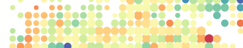](https://eurostat.github.io/gridviz/examples/styles/shapecolorsize_size_color.html)
[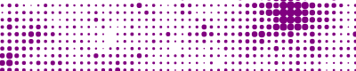](https://eurostat.github.io/gridviz/examples/styles/shapecolorsize_size.html)
[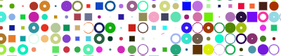](https://eurostat.github.io/gridviz/examples/styles/shapecolorsize_random.html)
[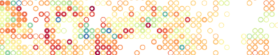](https://eurostat.github.io/gridviz/examples/styles/shapecolorsize_size_color.html)

This style is a generic style which allows to define the **shape**, **color** and **size** of each grid cell, independantly according to 3 different variables. Three shapes are currently available: square, circle, triangle (up, down, left or right) and donut (a disk with a hole of changing size). To show grid cells as small squares with only changing color, one of the styles based on web GL [here](#square-color-webgl-style) or [here](#square-color-category-webgl-style) should rather be used, for efficiency reasons.

-   See [this example with changing size](https://eurostat.github.io/gridviz/examples/styles/shapecolorsize_size.html) ([code](https://github.com/eurostat/gridviz/blob/master/examples/styles/shapecolorsize_size.html)).
-   See [this example with changing size and color](https://eurostat.github.io/gridviz/examples/styles/shapecolorsize_size_color.html) ([code](https://github.com/eurostat/gridviz/blob/master/examples/styles/shapecolorsize_size_color.html)).
-   See [this example with random shape, color and size](https://eurostat.github.io/gridviz/examples/styles/shapecolorsize_random.html) ([code](https://github.com/eurostat/gridviz/blob/master/examples/styles/shapecolorsize_random.html)).

### Square color WebGL Style

[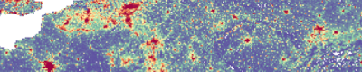](https://eurostat.github.io/gridviz/examples/styles/squarecolorwgl.html)
[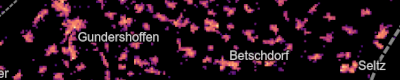](https://eurostat.github.io/gridviz/examples/styles/squarecolorwgl_dark.html)

This style displays each cell as a square, with a changing color. This style uses webGL and should thus be used to display grid cells at detailled resolutions.

-   See [this basic example](https://eurostat.github.io/gridviz/examples/styles/squarecolorwgl.html) ([code](https://github.com/eurostat/gridviz/blob/master/examples/styles/squarecolorwgl.html)).
-   See [this example with dark style](https://eurostat.github.io/gridviz/examples/styles/squarecolorwgl_dark.html) ([code](https://github.com/eurostat/gridviz/blob/master/examples/styles/squarecolorwgl_dark.html)).

### Square color category WebGL style

[](https://eurostat.github.io/gridviz/examples/styles/squarecolorcatwgl.html)

This style displays each cell as a square, with a changing color based on a categorical variable. This style uses webGL and should thus be used to display grid cells at detailled resolutions.

-   See [this basic example](https://eurostat.github.io/gridviz/examples/styles/squarecolorcatwgl.html) ([code](https://github.com/eurostat/gridviz/blob/master/examples/styles/squarecolorcatwgl.html)).

### Composition style

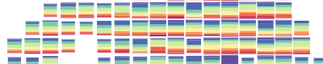
[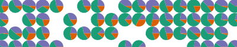](https://eurostat.github.io/gridviz/examples/styles/composition_types.html)

[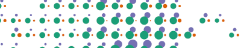](https://eurostat.github.io/gridviz/examples/styles/composition_types.html)
[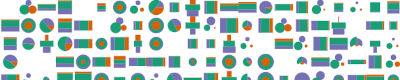](https://eurostat.github.io/gridviz/examples/styles/composition_types.html)

This style shows a composition at cell level in various different ways: Flags, pie charts, rings, segments, radar, age pyramid and halftone.

-   See [this basic example](https://eurostat.github.io/gridviz/examples/styles/composition_types.html) ([code](https://github.com/eurostat/gridviz/blob/master/examples/styles/composition_types.html)).

### Segment style

[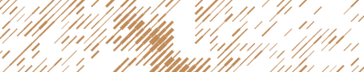](https://eurostat.github.io/gridviz/examples/styles/segment_width.html)
[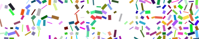](https://eurostat.github.io/gridviz/examples/styles/segment_random.html)

This style displays each cell as a segment with a changeable color, length, width and orientation.

-   See [this basic example](https://eurostat.github.io/gridviz/examples/styles/segment_width.html) ([code](https://github.com/eurostat/gridviz/blob/master/examples/styles/segment_width.html)).
-   See [this example with random segment orientation, color, length and width](https://eurostat.github.io/gridviz/examples/styles/segment_random.html) ([code](https://github.com/eurostat/gridviz/blob/master/examples/styles/segment_random.html)).

### Stroke style

[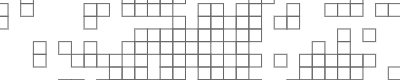](https://eurostat.github.io/gridviz/examples/styles/stroke.html)
[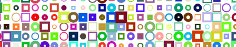](https://eurostat.github.io/gridviz/examples/styles/stroke_random.html)

This style shows the stroke of each cell with different colors, widths, shapes and sizes. This style can be used in addition to others to show the cell strokes on top of those other styles.

-   See [this basic example](https://eurostat.github.io/gridviz/examples/styles/stroke.html) ([code](https://github.com/eurostat/gridviz/blob/master/examples/styles/stroke.html)).
-   See [this an example with random color, size, width and shape](https://eurostat.github.io/gridviz/examples/styles/stroke_random.html) ([code](https://github.com/eurostat/gridviz/blob/master/examples/styles/stroke_random.html)).

## Advanced styles

### Dot density style

[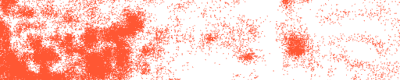](https://eurostat.github.io/gridviz/examples/styles/dotdensity.html)
[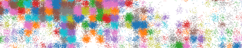](https://eurostat.github.io/gridviz/examples/styles/dotdensity_random.html)

This style displays each cell as randomly located points, with changeable density and color.

-   See [this basic example](https://eurostat.github.io/gridviz/examples/styles/dotdensity.html) ([code](https://github.com/eurostat/gridviz/blob/master/examples/styles/dotdensity.html)).
-   See [this example with random colors](https://eurostat.github.io/gridviz/examples/styles/dotdensity_random.html) ([code](https://github.com/eurostat/gridviz/blob/master/examples/styles/dotdensity_random.html)).

### Pillars style

[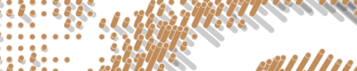](https://eurostat.github.io/gridviz/examples/styles/pillar.html)
[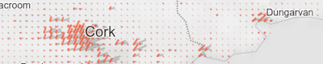](https://eurostat.github.io/gridviz/examples/styles/pillar_simple.html)

This style shows the grid cells as 3D pillars or, with changeable height, width and color.

-   See [this basic example](https://eurostat.github.io/gridviz/examples/styles/pillar.html) ([code](https://github.com/eurostat/gridviz/blob/master/examples/styles/pillar.html)).
-   See [this basic example with simple style](https://eurostat.github.io/gridviz/examples/styles/pillar_simple.html) ([code](https://github.com/eurostat/gridviz/blob/master/examples/styles/pillar_simple.html)).

### Ternary style

[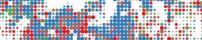](https://eurostat.github.io/gridviz/examples/styles/ternary_age_DE.html)

Ternary maps use color to show a composition according to three categories. Three different color hue are defined, that correspond to each of the three categories. The cells color is then selected according to the relative importance of the three categories. When two of the three categories are more important that the third, a color mix is used. A central class may be defined to show cases where the three categories are relativelly well balanced.

-   See [this example](https://eurostat.github.io/gridviz/examples/styles/ternary_age_DE.html) ([code](https://github.com/eurostat/gridviz/blob/master/examples/styles/ternary_age_DE.html)).
-   See [this other example](https://eurostat.github.io/gridviz/examples/demos/FR_age_ternary.html) ([code](https://github.com/eurostat/gridviz/blob/master/examples/demos/FR_age_ternary.html)).

Note that this style is not really a new style - it relies on a specific classifier.

### Text style

[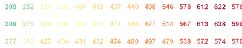](https://eurostat.github.io/gridviz/examples/styles/text_elevation.html)
[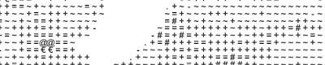](https://eurostat.github.io/gridviz/examples/styles/text.html)

This style shows the grid cells as text labels. The text, its color and font size can be set according to some cell values.

-   See [this basic example](https://eurostat.github.io/gridviz/examples/styles/text_elevation.html) ([code](https://github.com/eurostat/gridviz/blob/master/examples/styles/text_elevation.html)).
-   See [this example](https://eurostat.github.io/gridviz/examples/styles/text.html) ([code](https://github.com/eurostat/gridviz/blob/master/examples/styles/text.html)).

### Image style

[](https://eurostat.github.io/gridviz/examples/styles/image_kitten.html)
[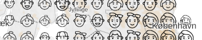](https://eurostat.github.io/gridviz/examples/styles/image_chernoff.html)

This style shows the grid cells as an image. The image and its size can be set according to some cell values.

-   See [this basic example](https://eurostat.github.io/gridviz/examples/styles/image_kitten.html) ([code](https://github.com/eurostat/gridviz/blob/master/examples/styles/image_kitten.html)).
-   See [this example, with Chernoff faces](https://eurostat.github.io/gridviz/examples/styles/image_chernoff.html) ([code](https://github.com/eurostat/gridviz/blob/master/examples/styles/image_chernoff.html)).

### Time series style

[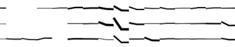](https://eurostat.github.io/gridviz/examples/styles/time_series.html)

This style shows the grid cells as a time series chart. It is particulary suitable to show data that has high temporal granularity and low geographical granurality (variation across time rather than space). The time series charts can be colored and sized according to other variables.

-   See [this basic example](https://eurostat.github.io/gridviz/examples/styles/time_series.html) ([code](https://github.com/eurostat/gridviz/blob/master/examples/styles/time_series.html)).

## Side styles

The **side styles** are special:They do not display the cells, but their sides. They can be used to show discontinuities between cell values with, for example, some shadow effect.

### Side style

[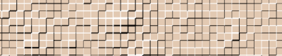](https://eurostat.github.io/gridviz/examples/styles/side.html)

This style displays the sides of the cells as segments with different colors and widths, depending on the values of the 2 adjacent cells.

-   See [this example](https://eurostat.github.io/gridviz/examples/styles/side.html) ([code](https://github.com/eurostat/gridviz/blob/master/examples/styles/side.html)).

### Side category style

[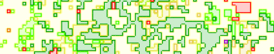](https://eurostat.github.io/gridviz/examples/styles/sidecat.html)

This style displays the sides of the cells as segments with different colors depending on the categories of the 2 adjacent cells.

-   See [this example](https://eurostat.github.io/gridviz/examples/styles/sidecat.html) ([code](https://github.com/eurostat/gridviz/blob/master/examples/styles/sidecat.html)).

### Contour style

[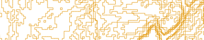](https://eurostat.github.io/gridviz/examples/styles/side_contour.html)

This style is experimental / under development. It displays the sides of the cells depending on discontinuities between the 2 adjacent cells, like contour lines.

-   See [this example](https://eurostat.github.io/gridviz/examples/styles/side_contour.html) ([code](https://github.com/eurostat/gridviz/blob/master/examples/styles/side_contour.html)).

### Isometric fence style

[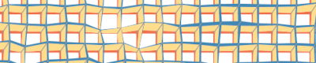](https://eurostat.github.io/gridviz/examples/styles/isofence.html)

This style shows the composition of a total quantity into categories as vertical cross-sections oriented toward North-South and East-West. It is an alternative to [composition style](#composition-style). It may also be seen as a bi-directional [joyplot style](#joyplot-style) showing categories - note that when **angle** value is set to 90°, the style is equivalent to a joyplot. This style was inspired by the [USGS geologic isometric fence diagrams (1953)](https://pubs.usgs.gov/pp/0228/).

-   See [this example](https://eurostat.github.io/gridviz/examples/styles/isofence.html) ([code](https://github.com/eurostat/gridviz/blob/master/examples/styles/isofence.html)).

## Esthetic styles

### JoyPlot Style

[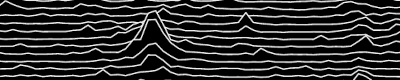](https://eurostat.github.io/gridviz/examples/styles/joyplot.html)
[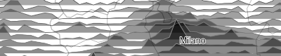](https://eurostat.github.io/gridviz/examples/styles/joyplot_shading.html)
[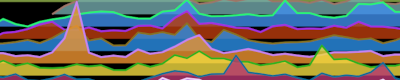](https://eurostat.github.io/gridviz/examples/styles/joyplot_random.html)

This style shows cell rows in the form of a 'joyplot' - named after Joy Division's "Unknown Pleasures" album cover. For joyplot style showing composition by categories, or for various orientations and perspective angles, see [isometric fence style](#isometric-fence-style).

-   See [this basic example](https://eurostat.github.io/gridviz/examples/styles/joyplot.html) ([code](https://github.com/eurostat/gridviz/blob/master/examples/styles/joyplot.html)).
-   See [this an example of shaded joyplot](https://eurostat.github.io/gridviz/examples/styles/joyplot_shading.html) ([code](https://github.com/eurostat/gridviz/blob/master/examples/styles/joyplot_shading.html)).
-   See [this an example with random colors](https://eurostat.github.io/gridviz/examples/styles/joyplot_random.html) ([code](https://github.com/eurostat/gridviz/blob/master/examples/styles/joyplot_random.html)).

### Mosaic style

[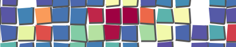](https://eurostat.github.io/gridviz/examples/styles/mosaic.html)
[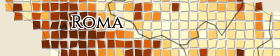](https://eurostat.github.io/gridviz/examples/styles/mosaic_full.html)

This style shows the cell as pseudo-irregular square shapes giving a [mosaic](https://en.wikipedia.org/wiki/Mosaic) effect. The cells are colored depending on a variable.

-   See [this basic example](https://eurostat.github.io/gridviz/examples/styles/mosaic.html) ([code](https://github.com/eurostat/gridviz/blob/master/examples/styles/mosaic.html)).
-   See [this roman style example](https://eurostat.github.io/gridviz/examples/styles/mosaic_full.html) ([code](https://github.com/eurostat/gridviz/blob/master/examples/styles/mosaic_full.html)).

### Ninja star style

[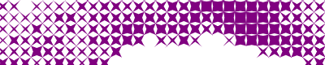](https://eurostat.github.io/gridviz/examples/styles/ninja_star.html)
[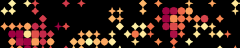](https://eurostat.github.io/gridviz/examples/styles/ninja_star_p.html)

This style shows the cell as a star polygon whose compacity depends on a variable. The higher the value, the more compact the star: Maximum values correspond to a square, and minimum values correspond to a thin star. The shapes in between correspond to 4 branches stars looking like a ninja star.

-   See [this basic example](https://eurostat.github.io/gridviz/examples/styles/ninja_star.html) ([code](https://github.com/eurostat/gridviz/blob/master/examples/styles/ninja_star.html)).
-   See [this other example](https://eurostat.github.io/gridviz/examples/styles/ninja_star_p.html) ([code](https://github.com/eurostat/gridviz/blob/master/examples/styles/ninja_star_p.html)) with stars parallel to the x/y axes.

### Tanaka style

[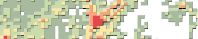](https://eurostat.github.io/gridviz/examples/styles/tanaka.html)

This style shows the grid cells in a [Tanaka style](https://manifold.net/doc/mfd9/example__tanaka_contours.htm), that is with discrete colors and a shadow effect.

-   See [this example](https://eurostat.github.io/gridviz/examples/styles/tanaka.html) ([code](https://github.com/eurostat/gridviz/blob/master/examples/styles/tanaka.html)).

### Lego style

[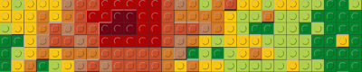](https://eurostat.github.io/gridviz/examples/styles/lego.html)

This style shows the grid cells as lego bricks with changeable colors and height based on a quantitative variable.

-   See [this example](https://eurostat.github.io/gridviz/examples/styles/lego.html) ([code](https://github.com/eurostat/gridviz/blob/master/examples/styles/lego.html)).

### Lego category style

[](https://eurostat.github.io/gridviz/examples/styles/lego_category.html)

This style shows the grid cells as lego bricks with changeable colors based on a categorical variable.

-   See [this example](https://eurostat.github.io/gridviz/examples/styles/lego_category.html) ([code](https://github.com/eurostat/gridviz/blob/master/examples/styles/lego_category.html)).

## Kernel smoothing

[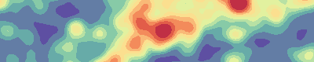](https://eurostat.github.io/gridviz/examples/styles/kernelsmoothing.html)

This style allows applying a gaussian kernel smoothing to the input grid. Other styles can then be used on the smoothed grid - this style is thus more a 'filter' than a proper style.

Note that this style is available within the [gridviz-smoothing](https://github.com/eurostat/gridviz-smoothing) extension which need to be added as: `<script src="https://cdn.jsdelivr.net/npm/gridviz-smoothing"></script>`.

-   See [this elementary example](https://eurostat.github.io/gridviz-smoothing/example/kernelsmoothing_small.html) ([code](https://github.com/eurostat/gridviz-smoothing/blob/master/example/kernelsmoothing_small.html)).
-   See [this example](https://eurostat.github.io/gridviz/examples/styles/kernelsmoothing.html) ([code](https://github.com/eurostat/gridviz/blob/master/examples/styles/kernelsmoothing.html)).

The kernel smoothing computation relies on the [fast-kde](https://www.npmjs.com/package/fast-kde) library, which produces smoothing approximation very fast. Note that the approximation degrades significantly for weak smoothing (for low sigma values).

## Custom styles

The style can be freely defined through the **drawFun**, which specifies how to draw the list of cells within the view on the map canvas.

-   See [this example](https://eurostat.github.io/gridviz/examples/basics/custom_style.html) ([code](https://github.com/eurostat/gridviz/blob/master/examples/basics/custom_style.html)) to define a simple style to draw each cell as an arrow symbol.

## Background layer

Background image layers may be defined:

-   as a tiled layer: See [this example](https://eurostat.github.io/gridviz/examples/basics/background.html) ([code](https://github.com/eurostat/gridviz/blob/master/examples/basics/background.html)) or [this other example](https://eurostat.github.io/gridviz/examples/basics/background_gisco.html) ([code](https://github.com/eurostat/gridviz/blob/master/examples/basics/background_gisco.html)).
-   or from a [OGC WMS - Web Map Service](https://www.ogc.org/standard/wms/): See [this example](https://eurostat.github.io/gridviz/examples/basics/background_WMS.html) ([code](https://github.com/eurostat/gridviz/blob/master/examples/basics/background_WMS.html)).
-   or as a single image file: See [this example](https://eurostat.github.io/gridviz/examples/basics/background_image.html) ([code](https://github.com/eurostat/gridviz/blob/master/examples/basics/background_image.html)).

## Foreground information

Foreground layers may be defined such as:

-   label layers: See [this example](https://eurostat.github.io/gridviz/examples/basics/labels.html) ([code](https://github.com/eurostat/gridviz/blob/master/examples/basics/labels.html)) or [this other example](https://eurostat.github.io/gridviz/examples/basics/labels_.html) ([code](https://github.com/eurostat/gridviz/blob/master/examples/basics/labels_.html)).
-   boundaries layers: See [this example](https://eurostat.github.io/gridviz/examples/basics/boundaries.html) ([code](https://github.com/eurostat/gridviz/blob/master/examples/basics/boundaries.html)).
-   points layers: See [this example](https://eurostat.github.io/gridviz/examples/basics/points.html) ([code](https://github.com/eurostat/gridviz/blob/master/examples/basics/points.html)).

## Transparency

To handle layer and style transparency, blending modes and alpha values may be defined at layer or style level. These values may be set according to the zoom level.

-   See [this example](https://eurostat.github.io/gridviz/examples/basics/blending_alpha.html) ([code](https://github.com/eurostat/gridviz/blob/master/examples/basics/blending_alpha.html)).

## Tooltip

A tooltip may be customised for the grid cells passed over the mouse pointer. By default, the list of properties is shown.

-   See [this example](https://eurostat.github.io/gridviz/examples/basics/tooltip.html) ([code](https://github.com/eurostat/gridviz/blob/master/examples/basics/tooltip.html)) to define the tooltip text.

## Buttons

To show zoom and full screen mode buttons, see [this example](https://eurostat.github.io/gridviz/examples/basics/buttons.html) ([code](https://github.com/eurostat/gridviz/blob/master/examples/basics/buttons.html)).

## View scale

For some predefined style parameters, _viewscale_ parameter allows defining styling parameters based on the cells within the map view only. This parameter is an object computed only once from the cells within the view. It may be used for example to compute the minimum and maximum values of these cells and adapt a color scale to this for a better contrast. It should generally be used to compute scales that are view dependant - hence the name _viewscale_.

-   See [this basic example](https://eurostat.github.io/gridviz/examples/basics/viewscale_basic.html) ([code](https://github.com/eurostat/gridviz/blob/master/examples/basics/viewscale_basic.html)).
-   See [this more advanced example](https://eurostat.github.io/gridviz/examples/basics/viewscale.html) ([code](https://github.com/eurostat/gridviz/blob/master/examples/basics/viewscale.html)) using some predefined function.

## Stretching

Most of [Gridviz](https://github.com/eurostat/gridviz/) styles rely on a continuous mapping from a statistical variable to a visual variable (color, size, etc.). The statistical distribution can be stretched with one of the _stretching functions_ listed below can be used. These are continuous bijective functions defined from _[0,1]_ to _[0,1]_ intervals. They have different properties and should be chosen according to the data distribution. The amplitude of the stretching can be adjusted with a parameter.

| Stretching function      | Description                 | Stretching parameter                                       |
| ------------------------ | --------------------------- | ---------------------------------------------------------- |
| **powerScale**           | Polynomial function         | Power exponent, from 0 to Infinity. No change: 1           |
| **powerInverseScale**    | Polynomial inverse function | Power exponent, from 0 to Infinity. No change: 1           |
| **logarithmicScale**     | Exponential function        | Logarithmic base, from -Infinity to Infinity. No change: 0 |
| **exponentialScale**     | Exponential                 | Logarithmic base, from -Infinity to Infinity. No change: 0 |
| **circularScale**        | Circular                    | 0: no stretching. 1: perfect circle section                |
| **circularInverseScale** | Circular                    | 0: no stretching. 1: perfect circle section                |

For more information on these functions and an overview of how they differ, see:

-   [this basic example](https://eurostat.github.io/gridviz/examples/basics/viewscale_basic.html) ([code](https://github.com/eurostat/gridviz/blob/master/examples/basics/viewscale_basic.html)).
-   [this other example based on webGL style](https://eurostat.github.io/gridviz/examples/basics/stretching.html) ([code](https://github.com/eurostat/gridviz/blob/master/examples/basics/stretching.html)).
-   the [code](../src/utils/stretching.js)
-   those [graphs](https://observablehq.com/@jgaffuri/stretching)

## Legends

Gridviz offers several types of legends that are suited to different cartographic styles.

The legend elements are added within a default HTML element. To define where the legend elements should be added, see [this example](https://eurostat.github.io/gridviz/examples/legends/external_legend.html) ([code](https://github.com/eurostat/gridviz/blob/master/examples/legends/external_legend.html)).

Each legend can be customised using the 'D3-like' _style()_ function after constructing the legend, like so:

```javascript
new gridviz.SizeLegend({
    title: 'Number of inhabitants',
    exaggerationFactor: 0.8,
    shape: 'circle',
    fillColor: '#3E5791',
}).style('padding', '0px 5px')
```

### Color legend


-   See [this example](https://eurostat.github.io/gridviz/examples/legends/colorLegend.html) ([code](https://github.com/eurostat/gridviz/blob/master/examples/legends/colorLegend.html)).
-   See [this example](https://eurostat.github.io/gridviz/examples/legends/colorLegendViewScale.html) ([code](https://github.com/eurostat/gridviz/blob/master/examples/legends/colorLegendViewScale.html)) for a view scale based style.
-   See [this example](https://eurostat.github.io/gridviz/examples/legends/colorLegendText.html) ([code](https://github.com/eurostat/gridviz/blob/master/examples/legends/colorLegendText.html)) for a legend with static text.
-   See [this example](https://eurostat.github.io/gridviz/examples/legends/colorLegendDiverging.html) ([code](https://github.com/eurostat/gridviz/blob/master/examples/legends/colorLegendDiverging.html)) for a legend with diverging color ramp.

### Color discrete legend

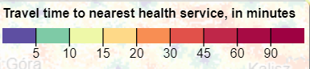

-   See [this example](https://eurostat.github.io/gridviz/examples/legends/colorDiscreteLegend.html) ([code](https://github.com/eurostat/gridviz/blob/master/examples/legends/colorDiscreteLegend.html)).
-   See [this example](https://eurostat.github.io/gridviz/examples/legends/colorDiscreteLegendViewScale.html) ([code](https://github.com/eurostat/gridviz/blob/master/examples/legends/colorDiscreteLegendViewScale.html)) for a view scale based style.
-   See [this example](https://eurostat.github.io/gridviz/examples/legends/colorQuantileLegendViewScale.html) ([code](https://github.com/eurostat/gridviz/blob/master/examples/legends/colorQuantileLegendViewScale.html)) for a quantile view scale based style.

### Color category legend

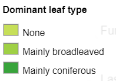

-   See [this example](https://eurostat.github.io/gridviz/examples/legends/colorCategoryLegend.html) ([code](https://github.com/eurostat/gridviz/blob/master/examples/legends/colorCategoryLegend.html)).

### Orientation legend

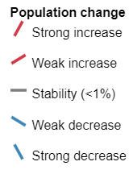

-   See [this example](https://eurostat.github.io/gridviz/examples/legends/orientationLegend.html) ([code](https://github.com/eurostat/gridviz/blob/master/examples/legends/orientationLegend.html)).

### Size legend

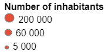

-   See [this example](https://eurostat.github.io/gridviz/examples/legends/sizeLegend.html) ([code](https://github.com/eurostat/gridviz/blob/master/examples/legends/sizeLegend.html)).
-   See [this example](https://eurostat.github.io/gridviz/examples/legends/sizeDiscreteLegend.html) ([code](https://github.com/eurostat/gridviz/blob/master/examples/legends/sizeDiscreteLegend.html)) for a discrete style.
-   See [this example](https://eurostat.github.io/gridviz/examples/legends/sizeLegendViewScale.html) ([code](https://github.com/eurostat/gridviz/blob/master/examples/legends/sizeLegendViewScale.html)) for a view scale based style.
-   See [this example](https://eurostat.github.io/gridviz/examples/legends/sizeQuantileLegendViewScale.html) ([code](https://github.com/eurostat/gridviz/blob/master/examples/legends/sizeQuantileLegendViewScale.html)) for a quantile view scale based style.

### Width legend

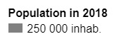

-   See [this example](https://eurostat.github.io/gridviz/examples/legends/widthLegend.html) ([code](https://github.com/eurostat/gridviz/blob/master/examples/legends/widthLegend.html)).
-   See [this example](https://eurostat.github.io/gridviz/examples/legends/widthDiscreteLegend.html) ([code](https://github.com/eurostat/gridviz/blob/master/examples/legends/widthDiscreteLegend.html)) for a discrete style.
-   See [this example](https://eurostat.github.io/gridviz/examples/legends/widthLegendViewScale.html) ([code](https://github.com/eurostat/gridviz/blob/master/examples/legends/widthLegendViewScale.html)) for a view scale based style.
-   See [this example](https://eurostat.github.io/gridviz/examples/legends/widthQuantileLegendViewScale.html) ([code](https://github.com/eurostat/gridviz/blob/master/examples/legends/widthQuantileLegendViewScale.html)) for a quantile view scale based style.

### Ternary color legend


-   See [this example](https://eurostat.github.io/gridviz/examples/styles/ternary_age_DE.html) ([code](https://github.com/eurostat/gridviz/blob/master/examples/styles/ternary_age_DE.html)).

## Leaflet

Gridviz can be used with leaflet by using the [leaflet-gridviz plugin](https://github.com/eurostat/leaflet-gridviz)

## Limit panning and zooming

See [this example](https://eurostat.github.io/gridviz/examples/basics/limits.html) ([code](https://github.com/eurostat/gridviz/blob/master/examples/basics/limits.html)) to limit the panning and zooming to some limit values, in order to prevent the user to move toward undesired positions and zoom levels. Note that the panning limit applies to the map center, not the map borders. The panning limit is specified as an array _[xMin, yMin, xMax, yMax]_.

## Mixed resolution grids

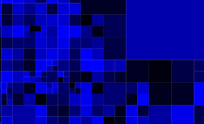

A mixed-resolution grid is a grid which contains cells with different sizes.

-   See [this example](https://eurostat.github.io/gridviz/examples/basics/mixed_resolution.html) ([code](https://github.com/eurostat/gridviz/blob/master/examples/basics/mixed_resolution.html)).
-   See [this other example](https://eurostat.github.io/gridviz/examples/basics/mixed_resolution_BE.html) ([code](https://github.com/eurostat/gridviz/blob/master/examples/basics/mixed_resolution_BE.html)).

Note that most pre-defined styles of GridViz may not apply for mixed-resolution grids. [Custom styles](#custom-styles) can be defined.

## Alright?

Anything unclear or missing? Feel free to [ask](https://github.com/eurostat/gridviz/issues/new) !
