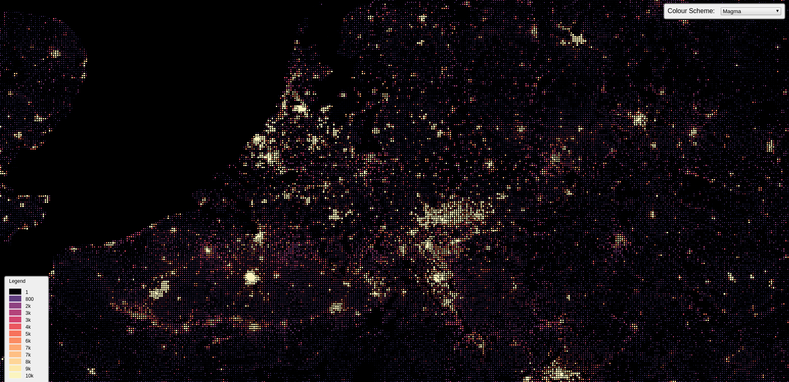

# GridViz

A JavaScript Library for visualizing gridded statistics from CSV files. From any given CSV file, GridViz will build a Three.js viewer capable of visualizing hundreds of thousands of grid cells.

{:height="150px" width="150px"}
<!-- .element height="50%" width="50%" -->
<!-- .element height="50%" width="50%" -->
<!-- .element height="50%" width="50%" -->
<!-- .element height="50%" width="50%" -->
<!-- .element height="50%" width="50%" -->

## [Live demo](https://eurostat.github.io/GridViz/examples/basic/index.html)

## Description

GridViz allows you to visualize large gridded datasets on the browser. Unlike raster-based approaches, this tool utilizes WebGL through Three.js in order to render eveything client-side.

## Installation & Usage

Coming soon...
