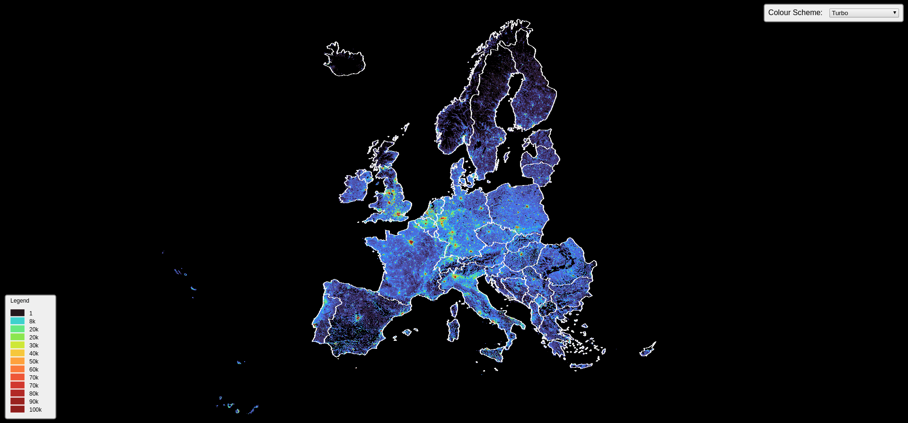
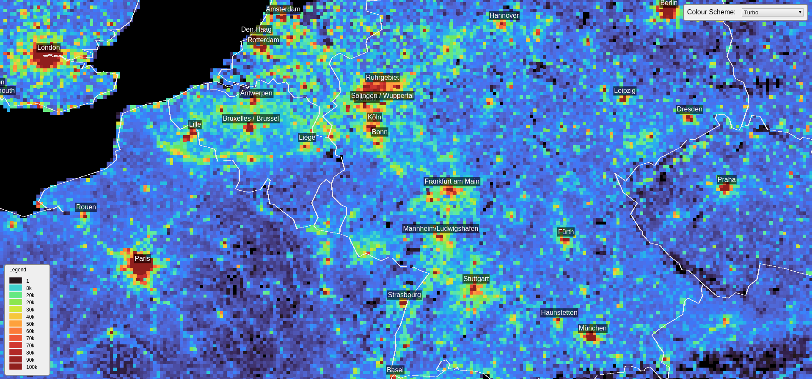
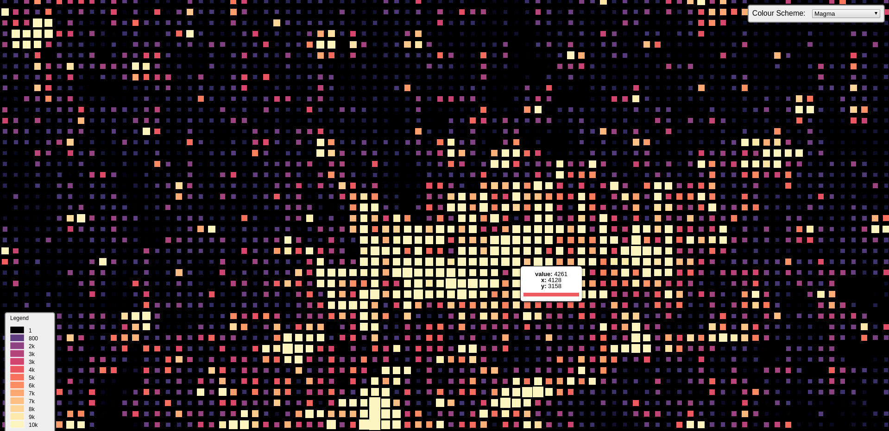

# GridViz

A JavaScript Library for visualizing gridded statistics from CSV files. From an x,y,indicator format CSV file, GridViz will build a Three.js viewer capable of visualizing hundreds of thousands of grid cells.

  

## Examples

[Europe - 5km² Population Grid](https://eurostat.github.io/GridViz/examples/europe/5km/index.html) | [Data Source](https://ec.europa.eu/eurostat/web/gisco) 

[Europe - 2km² Population Grid](https://eurostat.github.io/GridViz/examples/europe/2km/index.html) | [Data Source](https://ec.europa.eu/eurostat/web/gisco)  

[Europe - 1km² Population Grid](https://eurostat.github.io/GridViz/examples/europe/1km/index.html) | [Data Source](https://ec.europa.eu/eurostat/web/gisco)  

[Netherlands - Inhabitants per 100m²](https://eurostat.github.io/GridViz/examples/netherlands/index.html) | [Data Source](https://www.cbs.nl/nl-nl/dossier/nederland-regionaal/geografische-data/kaart-van-100-meter-bij-100-meter-met-statistieken)  

[France - 1km² Population Grid](https://eurostat.github.io/GridViz/examples/france/index.html) | [Data Source](https://insee.fr/fr/statistiques/4176290?sommaire=4176305)  

[France - Inhabitants over 80 years of age per 1km²](https://eurostat.github.io/GridViz/examples/france/population-over-80.html) | [Data Source](https://insee.fr/fr/statistiques/4176290?sommaire=4176305)   

## Description

GridViz is a JavaScript library which allows you to visualize large gridded datasets. Unlike traditional raster-based approaches, this tool utilizes WebGL through Three.js in order to render eveything client-side.

## Installation & Usage

Coming soon...
